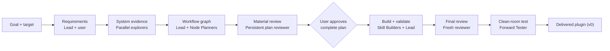

# PAVE: Patterns for Agentic Verifiable Engineering

Patterns and principles, proven in practice, for making agentic workflows
robust. Extracted from the lessons of building AMMO (Agentic Model-on-Machine
Optimizer), a staged multi-agent GPU kernel optimization campaign that ships
only changes proven correct and statistically faster.

## What is PAVE

PAVE is a way to engineer agentic workflows as graphs: a small workflow
language plus the patterns for using it well, specified in
[`skills/pave-init/references/pave-spec.md`](skills/pave-init/references/pave-spec.md).
A workflow is a graph of nodes. Each node declares the outcomes it can emit,
each outcome names the evidence that proves it, and each edge declares where
an outcome routes next. Agents keep the hard judgment calls; scripts, schemas,
and hooks enforce only the mechanical rules.

This makes a workflow verifiable instead of aspirational: a validator checks
the graph mechanically, an adversarial reviewer checks the judgment behind it,
and a running workflow can show the evidence for every step it claims it took.

### When PAVE fits

PAVE is not for every task. It earns its weight when the work has most of
these characteristics:

- a concrete target or purpose;
- observable evidence that changes decisions;
- several meaningful work states;
- conditional, recovery, or iteration paths;
- an explicit meaning for completion or acceptance;
- state that must survive between nodes or sessions;
- useful role or authority separation.

When few of these hold, a plain skill or checklist is the better tool.
`pave-init` makes this judgment itself at its first gate and returns a
verdict — `fit`, `fit_with_gaps`, or `not_fit` with the simpler alternative
named — before any design work starts.

### Core vocabulary

| Term | Meaning |
|---|---|
| Node | One bounded unit of work: a goal plus the smallest contract that lets one actor achieve it and prove it (purpose, inputs, effects, outcomes, roles). |
| Outcome | How a node ended. It names the situation (`baseline_captured`, `review_needs_evidence`), never the destination. |
| Evidence | Why the graph believes an outcome — an artifact the world produced, not the actor's own report that it worked. |
| Edge | How the graph responds: this outcome, from this node, moves the run there. Routing is declared before the run, never invented during it. |
| Control endpoint | A destination that is not work: a terminal, a pause for the user, a join for parallel branches. |
| Role | The perspective that acts in a node — including the user, whose approval gates are declared in the graph like any other node. |

Every node carries one of four intents — Plan, Explore, Execute, Review
(PEER) — and the success outcome's contract is the node's definition of done:
a condition settled by an act on world-produced evidence.

### The patterns

The "Patterns" in the name: recurring graph shapes the spec defines once so
every workflow can reuse them (spec §4 and §9).

- **Frozen purpose** — the approved goal cannot drift mid-run; change needs
  the user, not momentum.
- **Evidence before commitment** — explore and capture proof before the
  expensive or irreversible step, not after.
- **Independent challenge** — an adversarial reviewer attacks the work, but
  only material defects block; nitpicks never stall a run.
- **Failure as a path** — every failure routes somewhere declared. The default
  recovery loop: retry a transient blip once, then investigate to root cause
  with a persisted record, fix, and re-prove by the world.
- **The one-agent test** — a node is the right size when one agent can achieve
  its goal within one context; otherwise decompose it, never "try harder".
- **Designed stopping** — every loop names its stop; unlimited attempts are
  legal only with persisted investigation records and an operator-owned stop.
- **Proportional enforcement** — match the rung to the consequence: prose,
  then reinjection, then a blocking hook; never a blocking hook that can
  misfire.
- **Smallest sufficient graph** — ceremony must earn its place; a rule nobody
  can violate cheaply needs no machinery.

## What's Included

`pave-init` is a meta-skill — a workflow that builds workflows. It ships native
Claude Code and Codex packages generated from one maintained workflow source.
Each package contains a lead skill, native role agents, alignment hooks, a
run-state schema, and a README rendered from the approved plan. The shared PAVE
graph, system evidence, references, scripts, and traceability record remain one
physical source.

The 14 native lead and role files are generated installation artifacts. Do not
edit them directly. Change `sources/` or a shared reference, inspect
`python3 scripts/build_packages.py --check`, then regenerate explicitly with
`python3 scripts/build_packages.py --force`.

The Codex package uses V1 nested agents with `agents.max_depth = 2`. Claude
`fable` and `opus` roles map to `gpt-5.6-sol`; `sonnet` roles map to
`gpt-5.6-terra`. A persisted-thread preflight must prove the depth-2 chain
before release.

## Install

```text
/plugin marketplace add jinhuang12/pave
/plugin install pave-init@jinhuang12-plugins
```

Or load it for one session: `claude --plugin-dir <path-to-this-repo>`.

Then invoke it by name — it never starts on its own:

```text
/pave-init turn <goal> for <target system> into a workflow skill
```

For Codex, install or enable `.codex-plugin/plugin.json`, install the required
custom agents, review the hooks, and invoke the native skill:

```bash
python3 codex/install_agents.py --project /path/to/target-repository
```

```text
$pave-init:pave-init turn <goal> for <target system> into a workflow skill
```

See `codex/README.md` for project and user installation details.

## How a run flows

The stages below are plain-language groupings, not graph node ids. The real
graph is [`skills/pave-init/references/pave-init.pave.yaml`](skills/pave-init/references/pave-init.pave.yaml).



## Learn more

- [`skills/pave-init/README.md`](skills/pave-init/README.md) — the deep dive:
  full inputs and outputs, approval gates, the rendered canonical graph,
  agents, hooks, and file tree.
- [`skills/pave-init/references/pave-spec.md`](skills/pave-init/references/pave-spec.md)
  — the PAVE language specification.
- [`skills/pave-init/references/technique-selection.md`](skills/pave-init/references/technique-selection.md)
  — when debate, monitors, audits, and ledgers earn their cost, and when
  they hurt.
- [`skills/pave-init/VERSION`](skills/pave-init/VERSION) — the changelog.
