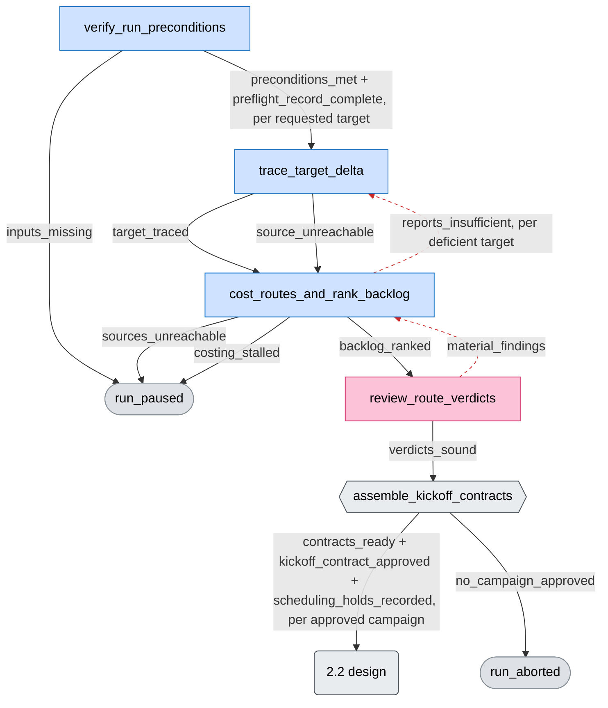
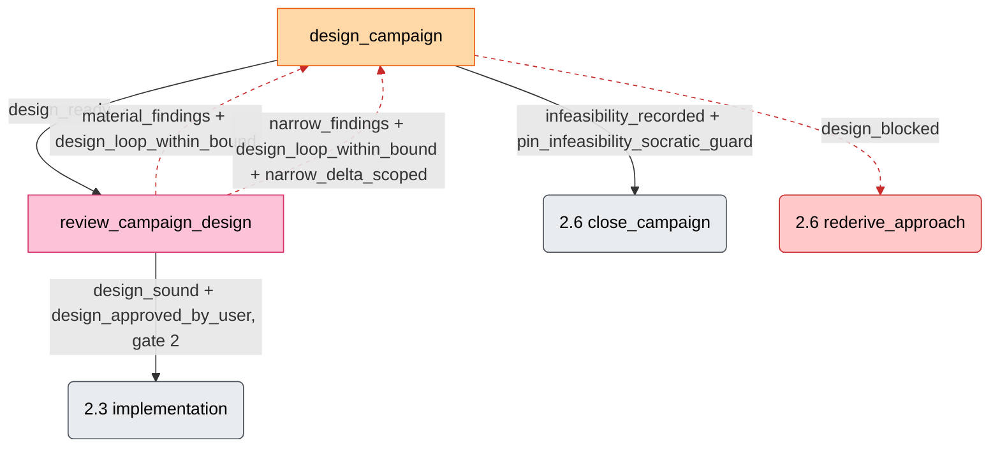
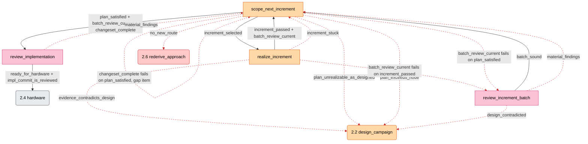
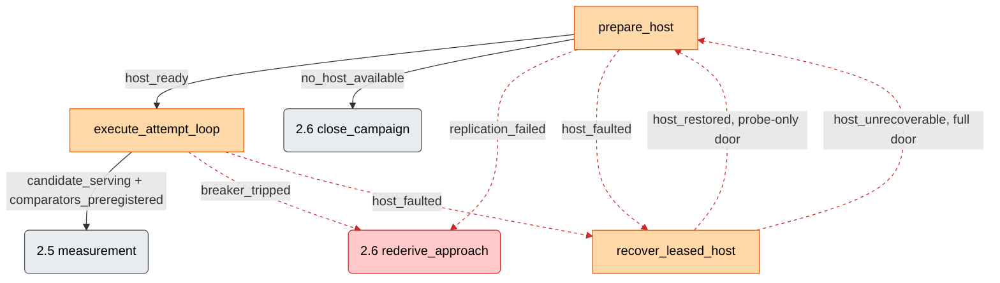
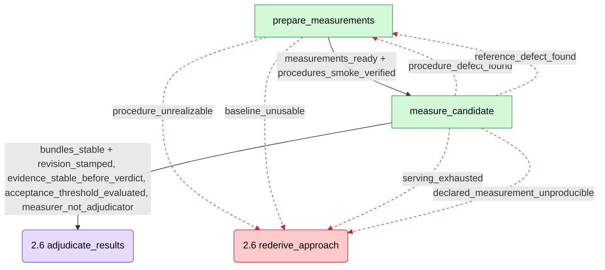
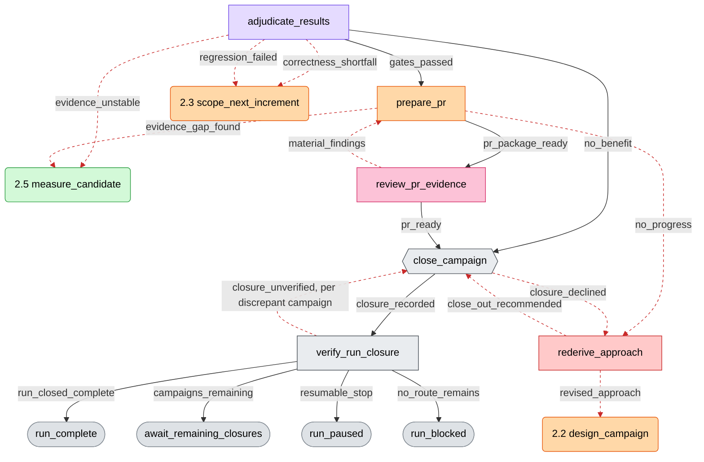

# vllm-neuron-parity

The vLLM-Neuron parity plugin, for Claude Code and for Codex. It brings the
vLLM-Neuron platform plugin (fork
`jinhuang12/vllm-neuron`) to feature parity with upstream GPU vLLM —
find the gaps, cost them, and close the approved ones with
evidence-backed pull requests, measured against a GPU baseline.

This README is a rendered view of the shipped package, never an
authority. The packaged graph (`workflow.pave.yaml`, the head of
`revisions.yaml`), the lead skill
(`skills/vllm-neuron-parity/SKILL.md`), and the role contracts stay
the source of truth; every section below links what it renders.

Claude Code registers the role contracts in `agents/*.md` directly. Codex
does not translate them at run time and installs the TOML contracts under
`codex/agents/` instead; both sets state the same duties, and the lead
skill's "Harness" paragraph maps the tool names between the two.

## 1. What it does, and for whom

For the maintainer of a vLLM-Neuron fork who needs upstream parity
closed methodically, not ad hoc. End to end: the workflow scans the
upstream delta per requested target, costs each closing route, ranks a
backlog, and asks you to pick campaigns (gate 1). Each approved
campaign is designed with pre-registered acceptance comparators
(gate 2), implemented in CPU-verifiable increments, brought up on
leased Neuron hardware, measured against the GPU baseline, adjudicated,
adversarially reviewed, and closed as an evidence-backed PR to the
fork, a no-benefit closure, or a blocked record (gate 3). Every closure
updates the committed cross-run scorecard, backlog, debt list, and
failure fingerprints.

Baseline and target pins are invocation-time inputs, so the workflow
survives re-baselines. PR merge stays human; fork sync stays yours.

### Installation

The plugin is the directory containing this README. It runs on either
harness.

**Claude Code.** Add the marketplace that lists this package and install
it; the six role agents (`agents/*.md`) and the twelve hooks
(`hooks/hooks.json`) register with the plugin, and `/hooks` lists them:

```text
/plugin marketplace add jinhuang12/pave
/plugin install vllm-neuron-parity@jinhuang12-plugins
```

Then seed the revision folder (step 7 below). Nothing else to install.

**Codex.**

1. Add this package to a configured local Codex marketplace, then install it:

```bash
codex plugin add vllm-neuron-parity@<marketplace>
```

2. Install the six custom agents into the target project:

```bash
python3 /path/to/vllm-neuron-parity/codex/install_agents.py --project /path/to/target
```

3. Trust the target project. Accept the Codex trust prompt, or add this to
   `~/.codex/config.toml`:

```toml
[projects."/absolute/path/to/target"]
trust_level = "trusted"
```

4. Keep subagents enabled in the target project's `.codex/config.toml`:

```toml
[agents]
enabled = true
max_concurrent_threads_per_session = 6
```

5. Verify the installed agents, then restart Codex in the target project:

```bash
python3 /path/to/vllm-neuron-parity/codex/install_agents.py --project /path/to/target --check
```

6. Open `/hooks`, review the twelve registered controls, and trust them when
   their paths match this package.

7. Both harnesses: seed the project's revision folder from the package before
   the first real run, then verify it (the lead skill's "Revision rules"
   says when to pin):

```bash
python3 /path/to/vllm-neuron-parity/scripts/record_revision.py install /path/to/target/.vllm-neuron-parity/evolution --from /path/to/vllm-neuron-parity
python3 /path/to/vllm-neuron-parity/scripts/record_revision.py verify /path/to/target/.vllm-neuron-parity/evolution
```

Requirements are declared in the lead skill's `metadata.compatibility` field:
the harness's plugin hooks (Codex asks you to trust them once), the
registered `vllm-neuron-parity:*` agents, bash, and Python 3.
Graph validation (`scripts/validate_pave.py`) additionally needs
`pyyaml` and `jsonschema` and fails closed without them. Run-state
validation (`scripts/validate_run_state.py`) uses `jsonschema` when present.
Without it, the dependency-free validator checks every schema keyword this
package declares.

Campaign stages additionally delegate to seven Neuron skills that are NOT
shipped in this plugin and must be resolvable in the session that runs a
campaign: `vllm-neuron-feature-port`, `neuron-framework-equivalence`,
`neuron-nki-profile-querying`,
`experimental-neuron-framework-benchmark-vllm` (the benchmark delegate whose
provisioning STOP gate P6 protects),
`experimental-neuron-framework-profiling-vllm-neuron`,
`experimental-neuron-framework-profile-analysis-vllm-neuron`, and
`experimental-neuron-autoport-compiler-debugging-vllm-neuron` (today:
the NeuronAgenticDevelopment workspace's `skills/` tree). The delta scan
through gate 1 needs none of them; a campaign whose delegate skill is
unavailable pauses and reports rather than substituting.

A successor revision of this plugin's graph depends on the pave-init plugin
(2.6.2 or later): its pave-evolve seats (`pave-init:workflow-updater`,
`pave-init:update-reviewer`) draft and review every successor. No run needs
pave-init until a defect in the graph pauses it.

Start a run by invoking `$vllm-neuron-parity:vllm-neuron-parity` with the fork
path, the upstream pin, and the GPU baseline pin. Note (disclosed in
the skill description): the stop guard hook blocks at most one stop in
three while a run is active.

## 2. Workflow summary and visual

At a glance — plain-language stage groupings (not graph node ids);
loops and recovery routes omitted here, faithful diagrams below:


Stage boxes are tinted by the agent that dominates the stage (color
key below).

The full graph has 22 nodes and 68 edges, so it is rendered as six
stage sub-diagrams. Rectangles are graph nodes labeled with node ids;
hexagons are user gates presented by a node (gates 1 and 3 — gate 2 is
a check on the `design_sound` edge, so it appears as edge text in
§2.2); stadiums are run endpoints; a rounded node names the
sub-diagram an edge continues in. Every edge carries its outcome
label. Source: `workflow.pave.yaml`.

Color code — node fill = the agent seat that runs the node, as bound
in the §4 table. That is usually the graph's first-listed role, with
two deliberate exceptions: `rederive_approach` carries the dedicated
rederiver seat (an agent binding, not a graph role), and
`verify_run_preconditions` is tinted for its investigating seat rather
than the lead that merely records the pin:

| Color | Agent / meaning |
|---|---|
| blue | investigator (intake, delta scan, costing, design screen) |
| orange | implementer (design drafting, increments, hardware, PR) |
| green | measurer (procedures, baseline, runs, bundles) |
| purple | adjudicator (verdicts and their consequence) |
| pink | adversarial-reviewer (the five review nodes) |
| red | rederiver (approach re-derivation — the recovery seat) |
| gray | lead-run nodes (user gates, run-closure verification), stage-level pointers, and run endpoints |

Dashed red edges are repair and recovery routing — backward re-entry
loops and every route into or out of `rederive_approach`, plus the
`recover_leased_host` loop. Solid edges are the forward path. A
rounded pointer naming a single node carries that node's seat color; a
pointer naming a whole stage stays gray. Styling is presentation only;
the graph stays the authority for nodes and edges.

### 2.1 Intake, delta scan, costing, gate 1



Dashed: the two repair re-entry loops (re-trace deficient targets, re-cost
on material findings). Costing owns the run-level delta index and the
coverage rubric, so a thin report re-fans from costing itself.

### 2.2 Campaign design, gate 2



Dashed: review findings re-entry (the full round, or the narrow block-scoped
repair when `narrow_delta_scoped` passes) and the design stop into
re-derivation. design_campaign runs four steps under one design-entry id
(screen, draft, register, assemble); the screen step is investigator-run,
the rest implementer-run, and a record gap that outlives its budget is
`design_blocked`.

### 2.3 CPU implementation loop



Dashed: stuck/repair loops, design re-entry, the two
`batch_review_current` failure routes into the per-batch review (every 1-3
landed increments get a fresh read-only reviewer seat before the next scope
round), and the `changeset_complete` failure route (the lead assembles the
changeset on `plan_satisfied`; a gap goes back into scoping as a
coverage-gap item). The increment_passed and batch_sound loops stay solid —
they are the stage's normal forward cycle. The design pointer is orange
because design_campaign is implementer-run apart from its screen step.

### 2.4 Neuron hardware bring-up



Dashed: the host-fault/recovery loop and both stop limit routes.
prepare_host has two doors: full (lease, then venv) on entry and after a
host is given up, probe-only after a recovery. recover_leased_host stays
implementer-orange — it is a recovery procedure but an implementer-run
node; the recovery LOOP is what the dashed edges mark. A lease reserves
named pools, not the host; the hardware queue tool writes every lease
record, so jobs of different campaigns share a host when their
reservations fit.

### 2.5 Measurement vs GPU baseline



Dashed: the two defect re-entry loops and the four budget/stop limit
routes into re-derivation. prepare_measurements realizes the procedures
and captures the GPU baseline; measure_candidate runs them and hands over
stable bundles, re-collecting a collection defect inside the node within
the shared repair budget.

### 2.6 Adjudication, PR, closure, re-derivation, gate 3



Dashed: the adjudicator's repair routes (the verdict names the consequence
itself; the PR review reads it), the PR findings loop, the PR no_progress
stop limit, and the re-derivation node's own routes (its revised_approach
return to design is the recovery loop closing). verify_run_closure is gray
because the lead runs it with no seat. The meas/impl/design pointers carry
their target nodes' agent colors.

## 3. File structure

The shipped package — one plugin for both harnesses:

```
vllm-neuron-parity/
  .codex-plugin/plugin.json            # Codex plugin manifest
  .claude-plugin/plugin.json           # Claude Code plugin manifest
  hooks/
    hooks.json                         # registers the twelve controls for both
                                       #   harnesses (restored in 1.3.0; Codex
                                       #   asks you to trust it once)
    pre_tool_use_router.py             # active-run scope adapter: P1-P3, the
                                       #   lead-only deny, the no-retry-copy rule,
                                       #   and the checkpoint sidecar
    write_limits.py                # reads write_limits.deny from the live graph at the newest revision
    write_log.py                       # PostToolUse write log: every path a Bash, Write, or Edit call wrote (hook-owned, lead-denied)
    dispatch_advisory.py               # advisory-only re-entry dispatch check
                                       #   (PreToolUse Agent|Task, lead-gated)
  codex/
    install_agents.py                  # explicit safe custom-agent installer
    agents/                            # complete native role contracts
      vllm_neuron_parity_investigator.toml
      vllm_neuron_parity_implementer.toml
      vllm_neuron_parity_measurer.toml
      vllm_neuron_parity_adjudicator.toml
      vllm_neuron_parity_adversarial_reviewer.toml
      vllm_neuron_parity_rederiver.toml
  skills/vllm-neuron-parity/           # skill location on both harnesses
    SKILL.md                            # the lead workflow skill
    hooks/
      protected-branch-guard.sh        # blocks pushes to protected branches
      compile-cache-guard.sh           # blocks every destructive touch of the shared Neuron caches (mv included)
      venv-opt-guard.sh                # blocks venv cloning / /opt writes
      graph_edit_guard.sh              # denies direct edits of the live graph or revisions.yaml outside an apply step
      state-staleness-reminder.sh      # re-presents run position periodically (lead-session-gated)
      stop-guard.sh                    # blocks at most 1 stop in 3 while a run is active (lead-session-gated); its audit check blocks one of those stops when an audit checkpoint comes due
      write-for-reader.sh              # reminds any actor to write documents for the reader (advisory, throttled); names an over-cap document, and under increments/ an over-cap file, header, or -rN retry copy
      goal-restate.sh                  # SessionStart resume|compact + SubagentStart: goal and fewest steps before acting
  agents/*.md                          # role contracts registered on Claude Code
  workflow.pave.yaml                   # immutable packaged graph seed (the newest revision; its revision number is revisions.yaml's, not this README's)
  revisions.yaml                       # immutable packaged revision log seed (entry 0 is the delivered graph; one history/v<N>.patch per later entry)
  references/
    artifact-layout.md                 # single authority for artifact shapes
    measurement-pitfalls.md            # known measurement-tool traps
    toolchain-evidence-pitfalls.md     # what the compiler and runtime say about themselves
    patch-mechanism-inventory.md       # how the plugin patches vLLM
    collision-ranking.md               # file surfaces where ports collide
    pave.schema.json                   # PAVE graph schema (validator input)
    pave-composition.schema.json       # composition-extension schema (validator input)
  schemas/run-state.schema.json        # single authority for run-state shape
  scripts/
    validate_run_state.py              # run-state checker
    validate_pave.py                   # graph checker
    record_revision.py                 # revision record tool: init, install, propose, apply, pin, verify, rollback
    measure_artifact.py                # living-document size vs its cap (references/artifact-layout.md §4.12)
    run_write_report.py                # what the run wrote since the last audit checkpoint (the block text's write report)
  tests/
    test_codex_port.py                 # Codex port: version pin, hook control count, TOML fields, legacy-token absence, harness tool map
    test_document_ceilings.py          # every prose document under its pinned line ceiling, and none unpinned
    test_hooks.sh                      # hook behaviour: marker gating, guards, reader reminder, cap notice, goal restatement
    test_measure_artifact.py           # size check tool tests
    test_run_state_schema.py           # schema accept/reject tests
    test_write_limits.py           # router modes: lead-only deny, no-retry-copy, checkpoint sidecar, write log
    test_validate_run_state_caps.py    # validate_run_state.py length caps and path checks, stdlib and jsonschema paths
    test_workflow_pave.py              # shipped-graph validity test
  README.md                            # this file — rendered view, never authority
  VERSION                              # package changelog
```

Revision record: the package is itself a valid revision folder — the shipped
`workflow.pave.yaml` plus `revisions.yaml` and the `history/` patches its
entries name — read the head's number from the revision log, never from this README;
the head's `digest_after` is the packaged digest.
`scripts/record_revision.py install` copies it into
`<project>/.vllm-neuron-parity/evolution/`, where one live graph, one
append-only revision log, and one `history/v<N>.patch` per apply step are the record;
only `record_revision.py` writes them, and `graph_edit_guard.sh` denies a direct
edit. Reinstalling the plugin does not touch that root. The authority is
pave-init's `references/pave-revisions.md` (under the pave-init plugin root);
the lead skill's "Revision rules" carries the run-time rules. Successors
are drafted and reviewed by the pave-init plugin's pave-evolve seats, so
a successor needs pave-init 2.6.2 or later installed. The updater's audit mode
at a checkpoint needs the same. On an older install the audit check records
the degradation once and stays silent. Package versions
in `VERSION` are separate — they track what a user of the plugin would notice
changed.

### Migrating an existing revision folder

A root created by the 1.3.x manifest scheme (`workflow-manifest.yaml`,
`history/v1/`, `binding-revisions.yaml`) migrates once, by hand. In that scheme
the live graph is `history/v1/workflow.pave.yaml`, amended in place; the 1.4.0
package revision log carries those amendments as revisions 1 and 2 and continues to
its own head, so the migration proves the old live graph is revision 2, installs
the packaged root in its place, and moves the run per evolution rule 7. Proven
on a scratch copy of a field root inside a git work tree with the tool as
shipped; `TOOL` is `<plugin-root>/scripts/record_revision.py`, run with a
Python that has pyyaml and jsonschema.

1. Put the root under version control first (`git add`): an interrupted step
   restores from it.
2. Prove the old live graph is revision 2: its bundle digest must equal the
   packaged revision log's revision 2 `digest_after`,
   `sha256:e9f063e2cde9752a0f530c4ceb9fe425873df2777f5c9dfa4135bc209e444e7c`
   (also the manifest's `bundle_digest`). Compute it with the tool's own
   function: `python3 -c "import sys, pathlib; sys.path.insert(0,
   '<plugin-root>/scripts'); import record_revision as r;
   print(r.live_digest(pathlib.Path('<root>/history/v1')))"`. A digest that
   differs is an amendment the package never received: stop, and land it as a
   successor through the pave-evolve seats before migrating, never by editing
   the revision log.
3. Move the old root aside (`git mv <root> <root>.pre-1.4.0`) and install the
   packaged root: `TOOL install <root> --from <plugin-root>`, then
   `TOOL verify <root>` exits 0 at the packaged head. `install` refuses a non-empty
   directory; it seeds fresh roots only, and it creates only the graph, the
   revision log, and `history/`. Move any evidence file the run cites from the old
   root (the seat investigations, the ceremony checklist) into the new root
   at the same relative path.
4. Move the run per rule 7. The run state still pins revision 1 with the
   digest above; in the revision log that digest is revision 2 (revision 1's
   `digest_after` is the graph layer alone, so `--pinned-revision 1` with it
   exits 1). `TOOL verify <root> --pinned-revision 2 --pinned-digest
   sha256:e9f063e2...` prints `ROUTE: graph applied since pin (revision 3)` and
   exits 3. With the user's approval recorded verbatim: `TOOL pin <root>
   --run-id <run id>`, set the run state's `active_revision` to the packaged
   head's revision and its digest to that entry's `digest_after`, and resume
   from the last satisfied
   gate — landed work stays landed. Where an applied revision adds a gate that
   landed work never passed (revision 1's `review_increment_batch` for
   increments landed before it), record a catch-up duty per landed item and
   discharge it before those items are promoted. `verify --pinned-revision
   <head> --pinned-digest <digest>` then exits 0 (current). A run that declines to
   move records the decline verbatim in run state
   (`workflow_identity.move_declined`) and stays pinned; the tool keeps
   printing the route, and the lead does not re-ask while the decline stands.
5. Delete the moved-aside root once step 4 is recorded — `workflow-manifest.yaml`,
   `binding-revisions.yaml`, `history/v1/`, `.codex-evolution-origin.json`, and
   the stale `workflow.draft.pave.yaml`: the revision log carries them, git history
   keeps them, and the guard does not cover `binding-revisions.yaml`, so it
   must not stay as a shadow revision log.

## 4. Specialized agents

Source: the agent contracts (`agents/*.md` on Claude Code, `codex/agents/*.toml`
on Codex) and the dispatch table in `SKILL.md`. The Model column gives the Codex
binding; each seat's Claude binding is the `model` field of its own
`agents/*.md` frontmatter, which is the authority dispatch reads on that
harness.

| Agent | Color (§2) | Role | Model | Key constraint (what it cannot do) |
|---|---|---|---|---|
| (lead = SKILL.md itself) | gray | routing, gates, state writes | session | sole writer of run state and cross-run artifacts; never measures or adjudicates |
| investigator | blue | intake, delta scan, costing, design screen | gpt-5.6-sol | read-only on the fork; cannot approve its own verdicts |
| implementer | orange | design drafting, increments, hardware attempts, PR package | gpt-5.6-sol (xhigh on the attempt loop) | never edits comparators; cannot merge PRs; hardware writes confined to lease/venv/worktree scope |
| measurer | green | procedures, baseline capture, runs, stabilize | gpt-5.6-sol (gpt-5.6-terra at stabilize) | executes what the design record froze — never chooses or alters a comparator; no verdicts |
| adjudicator | purple | verdicts, run-closure verification | gpt-5.6-sol | never produces the evidence it judges (measurer_not_adjudicator check) |
| adversarial-reviewer | pink | every review node in the pinned graph | gpt-5.6-sol | reviews only; one seat per gate, retained across a design entry's rounds and fresh per batch; cannot repair what it reviews |
| rederiver | red | approach re-derivation after stop limits | gpt-5.6-sol, xhigh | read-only inputs; its output re-enters design, it never implements. On an intermittent spawn failure the lead retries identically, never downgrades the model, and pauses for the operator after three identical failures — an undispatchable seat would dead-end all sixteen recovery routes |

The lead pauses if a `vllm-neuron-parity:*` agent type is unavailable —
it never substitutes an ordinary worker. A reviewer or adjudicator seat binds
at or above the producer whose artifact it judges — a judge below its producer
misses the findings that need the producer's whole reasoning — so the two
Claude judges bind the top Claude model, as the rederiver does for the reason
its own contract gives (a run-setup change recorded by release 1.4.0,
user-approved 2026-09-03; the revision log holds no `kind: run_setup` entry because
model bindings live in `agents/*.md`, outside the YAML the tool applies); the
Codex binding already met the rule.

Dispatch mechanics (retained threads — one doer thread per campaign across
the stage-6 loop — a reviewer retained per design entry, single state writer,
forbidden effects inherited into every spawn)
are in the lead skill's "Roles and dispatch"; this README does not restate them.

## 5. Hooks and enforcement

Source: the native `SKILL.md` (prohibitions P1–P13 and transition guards), the
active-run adapter, the write log, and the re-entry dispatch advisory under
`hooks/`, and the eight policy scripts under
`skills/vllm-neuron-parity/hooks/`. Enforcement levels,
weakest to strongest: prose < reminder < reviewed < mechanical
< blocking hook.

| Rule | Enforcement level | Why that enforcement level |
|---|---|---|
| Never mutate protected branches (release-0.24.0.1.1.0, release-0.21.0.1.0.0, main, mainline — exact names) | BLOCKING hook | likely, costly, irreversible, precisely detectable. Disclosed residual: the no-refspec `git push` arm resolves the current branch in the payload's cwd and fails open — a push that changes directory (`cd … && git push`, `git -C … push`) or a non-default `push.default` can evade it; explicit-refspec and mutation forms are exact matches, and contract text plus the next review gate back the hook |
| Never clear a shared Neuron compile cache (three vLLM compile-cache roots plus the kernel intermediate cache) | BLOCKING hook + delegate wrapper | documented remedies include cache-clearing, so delegates will try it; hours of recompile for every tenant, and the kernel cache can hold a co-tenant's artifacts |
| No `cp -a` venv cloning; no pip writes into /opt | BLOCKING hook | dead-end pressure makes the shortcut likely; /opt damage breaks co-tenants |
| Never edit the live graph or the revision log outside an apply step (`skills/vllm-neuron-parity/hooks/graph_edit_guard.sh`) | BLOCKING hook (PreToolUse Edit\|Write\|MultiEdit) | the violation has happened (v1 amended in place), it is path-detectable, and `record_revision.py apply` is the only legitimate writer; denies when `revisions.yaml` sits beside the target and no `.applying` marker exists |
| Zero NxDI imports in ported code | MECHANICAL scan (diff-scoped) | exact over added/modified lines; runs before the review gate |
| GPU baseline read-only; no autonomous reboot; durable-host-state scoping | prose + reminder + mechanical identity/skew probes | a hook cannot see remote SSH side effects; capture refuses on contradiction |
| Benchmark skill's provisioning STOP gate never removed | prose + reminder | text edit, cheap to catch at review, reversible |
| PRs only to the fork; merge stays human | MECHANICAL (PR URL verified on the fork) + capability absence | merge authority is never granted — stronger than any check |
| No identical hardware retry | MECHANICAL fingerprint gate | fingerprint equality is exact; pre-attempt precondition |
| Comparators frozen before measurement | MECHANICAL timestamp check | registration-timestamp arithmetic is exact |
| One writer per record: the lead for run state and cross-run artifacts, the hardware queue tool for leases | STRUCTURE + schema validation | ownership-by-structure beats detection; budgets are derived from files, never stored |
| Measured revision = git-issued id, never a branch name | MECHANICAL check | exact string-shape + agreement test |
| Two-tier repair budgets and stop limits (measure three/nine; hardware ten + one recovery) | BLOCKING routing preconditions | counts derived from event files; runaway loops are the costliest failure |
| Lead hook pair (staleness reminder + stop guard) | reminder | long-horizon, session-crossing workflow — the pair's target case; the stop guard **blocks at most one stop in three** while a run is active, disclosed in the skill description. It asks for one line per active seat from run state: what that seat waits on, and the next act ("nothing" means act before stopping). Then it states its reminders as duties. There is no bare-acknowledgement exit. Both hooks gate on the lead session id in `<run-state>.lead-session` and stay silent in every other session; without the sidecar they fail open |
| Audit checkpoint (the stop guard's audit check) | reminder, block-once | a design-time graph cannot forecast the forms a fourteen-day run invents. About forty recurring acts and ~95% of the observed cost were lead-invented, and the only self-correction moment was answered "lgtm" 288 times out of 308. Every `VLLM_NEURON_PARITY_AUDIT_EVERY` declared-node outcomes (default 40), or `_AUDIT_BYTES` of writes (default 200 MB), the branch blocks ONE stop on the existing one-in-three cooldown. The block text is the whole brief: write report, checkpoint id, one dispatch line. Only a workflow-updater-drafted landing or a reviewer-PASSed no-change closes the cycle. A later audit loses nothing, so the enforcement level stays below blocking; it never blocks a traversal. Enforcement table: `references/artifact-layout.md` §4.14 |
| Lead-only write deny (`write_limits.deny` in the live graph) and the no-retry-copy rule | BLOCKING hooks | the cut list lives IN the graph file. It is applied as a `kind: run_setup` entry and is read at every call from the newest revision; there is no hook-owned rule list. The deny binds the lead alone, and landing the reversal reverses it. A seat whose target matches gets the reason as advice, so no glob can strand a seat. The no-retry-copy rule refuses, for every actor, a `<stem>-rN.<ext>` file beside a same-stem file. The new name may come from a file write or from a shell command (any argument, redirect target, or copy/move destination, cwd tracked per segment). The existing file may itself sit under a parked marker (`.superseded`, `.bak`). The rule blocks because the advisory form named 6,684 retry copies in one run without effect. The remedy is always available: edit working state in place; give external output a name keyed to its event. The PostToolUse write log makes script-mediated writes visible to the write report; the shipped Write\|Edit hooks never saw them. Enforcement table: `references/artifact-layout.md` §4.14 |
| Goal restatement at every context rebuild (`skills/vllm-neuron-parity/hooks/goal-restate.sh`) | reminder (advisory `additionalContext`, never blocks) | a compaction summary or a fresh seat brief loses the goal and, with it, the sunk cost of the process — the cheapest moment to reconcile the one and cut the other. SessionStart resume\|compact asks the lead for the goal from run state and the active campaign's `approvals/DECISIONS.md` and for the fewest steps toward it (what breaks if you skip it); SubagentStart asks each seat for its brief's goal and why it serves the run's. Lead-session-gated like the pair; silent without the marker or on a terminal run |
| Re-entry dispatch advisory (`hooks/dispatch_advisory.py`) | reminder (advisory `additionalContext`, never blocks) | edge-triggered: fires only when a dispatch names an instrumented design node that already completed a traversal this run, and asks whether the graph's cheaper re-entry check tool decides it without a seat; lead-session-gated, throttled per node via its own counter file |
| Documents are written for the reader (`skills/vllm-neuron-parity/hooks/write-for-reader.sh`) | prose + reminder (advisory `additionalContext`, never blocks) + REVIEWED | agents drift back to identifier chains and inlined checker output the moment the plain-writing rule leaves context; the hook fires on the first `.md` write under `artifacts/` and every third after it per session, for any actor, marker-gated and terminal-silent, and skips working state (attempts, measurements, index, intake-preflight); the adversarial reviewer treats an illegible reader-facing artifact as a material finding; the hook also names an over-cap document with its size (`references/artifact-layout.md` §4.12) once per session and file, past the throttle, and the reviewer records each living document's lines and bytes every round. Under `increments/` the same hook measures `.py`, `.sh`, `.md`, and `.txt` writes against the §4.12 increments row (200 lines, 20 header lines, one revision edited in place; the 100-line lap-record cap is the reviewer's) and names an over-cap file, an over-cap header, or a round-suffixed (`-rN`) retry copy once per file past the throttle; the batch review records `scripts/measure_artifact.py --classify` (code / comment / docstring split) and `--tree` (increments/ write report since the last batch). The first run under this plugin wrote 10,844 files there with no cap, two thirds of them retry copies (1.5.4) |
| New kernel-class functionality must be NKI, never torch fallback (kernel-substrate rule) | MECHANICAL (every increment must declare kernel-class or not — no silent omission; a declared-NKI increment with zero NKI usage in its diff is an exact contradiction caught at the changeset scan) + REVIEWED (both gates challenge the classification itself) | "what is kernel-class" is judgment no scan decides, and absence-of-torch scans false-fire on kernels' legitimate torch boundaries — so the mechanical half checks presence against the doer's own declaration, and review owns only the classification |

`SKILL.md` carries 13 run-wide prohibitions and 6 transition guards in
total; this table shows the strongest rows, and every rule not shown
sits at a weaker enforcement level with its rationale in the skill and agent
contracts. `hooks/hooks.json` registers the twelve controls at plugin scope (the
three P1-P3 guards, the graph edit guard, the lead-only deny (whose PostToolUse half hook-records the audit seats' writes), the no-retry-copy rule,
the write log, the lead hook pair, the re-entry dispatch advisory, the
write-for-the-reader reminder, and the goal restatement); a fresh install on
either harness registers the same twelve, and Codex asks you to trust it once. On Codex, SessionStart fires at startup and resume (no compact
source) and SubagentStart has no dispatch, so the lead is asked at resume and
seats are not — a recorded degradation there. The audit check finds pave-init
through `VLLM_NEURON_PARITY_PAVE_INIT_ROOT`, the plugin cache beside this
plugin, or the `~/.claude` and `~/.codex` plugin caches. It says so when it
finds none.
P1-P3 fail open unless `.vllm-neuron-parity-run` points to active nonterminal
state, so they do not block unrelated Codex work.
Nothing registers silently.

## 6. Appendix — the shipped authorities

- `workflow.pave.yaml` and `revisions.yaml` — the immutable packaged seed, at
  its newest revision (22 nodes, 68 edges, 24 evidence definitions, 5 endpoints;
  validates clean with `scripts/validate_pave.py`). The head's revision number
  and check count are the revision log's, not this README's — read them from
  `revisions.yaml` and the validator, which is why no number here can go
  stale. A project's
  live graph is the newest revision of its revision folder, changed only by an
  apply step; run-setup revisions (`kind: run_setup`) never change graph meaning, so
  never move node, edge, or check counts; a count change is a graph successor
  - revision rule 7 says how the run moves. Read live counts from the
  validator, not from here.
- `skills/vllm-neuron-parity/SKILL.md` — the lead: routing, gates,
  state writes, recovery loop, revision rules (one-clause run-time rules;
  the authority is pave-init's `references/pave-revisions.md`).
- `scripts/record_revision.py` — the only writer of the revision folder:
  `init`, `install`, `propose`, `apply`, `pin`, `verify`, `rollback`.
- `codex/agents/vllm_neuron_parity_*.toml` — the six complete native
  custom-agent contracts installed by `codex/install_agents.py`.
- `schemas/run-state.schema.json` — the run-state shape authority;
  check an instance with `scripts/validate_run_state.py`.
- `references/artifact-layout.md` — artifact tree, write ownership,
  precedence, supersession rules for a live run.
- `references/measurement-pitfalls.md` — measurement-tool traps the
  measurer must pre-empt, and the check-tool liveness duty behind
  `acceptance_threshold_evaluated`.
- `references/toolchain-evidence-pitfalls.md` — how to read the Neuron
  compiler and runtime channels: flags, compile cost, per-core artifacts,
  late bounds, knob delivery, wedge state.
- `references/patch-mechanism-inventory.md` — how the vllm-neuron
  plugin patches vLLM, and where a ported change lands.
- `references/collision-ranking.md` — which fork files concurrent
  campaigns collide on, and the serialization rules.
