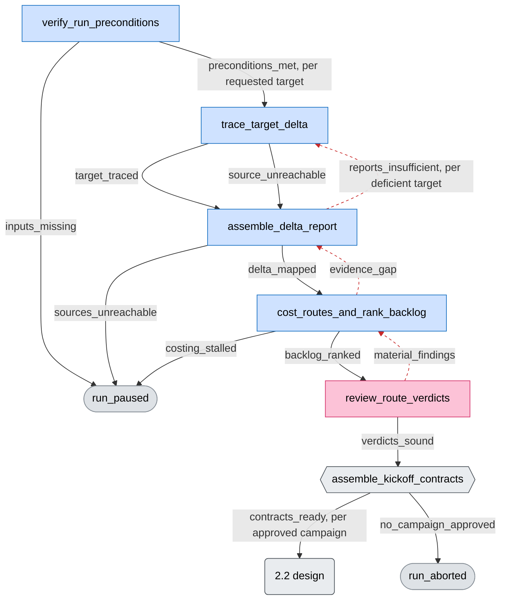
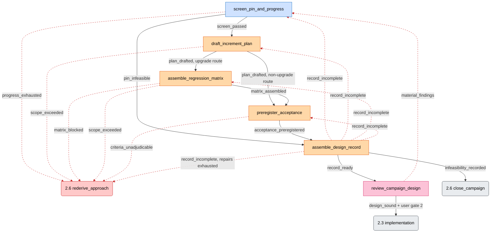
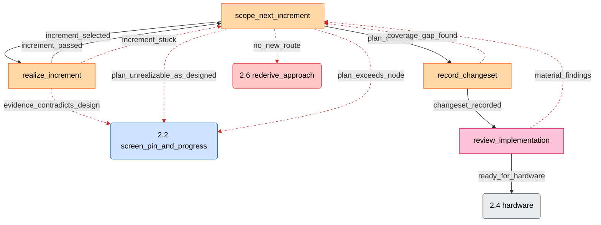
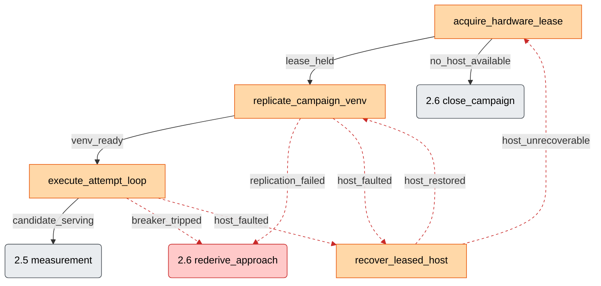
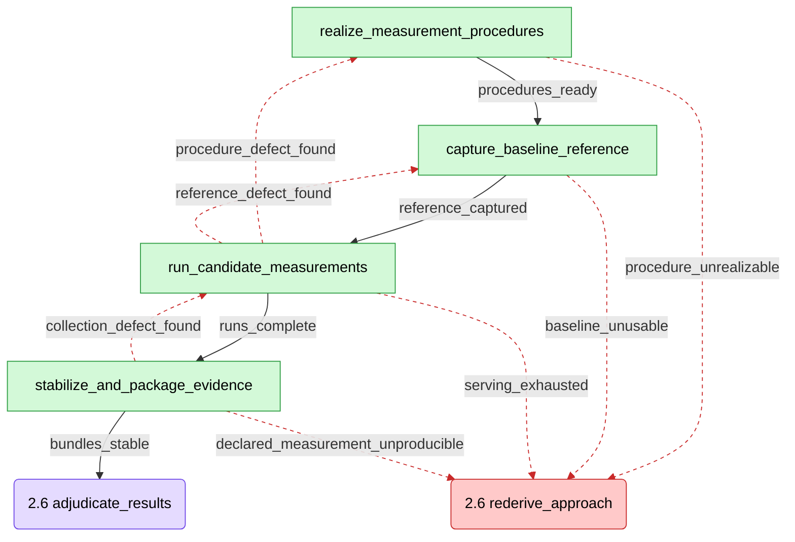
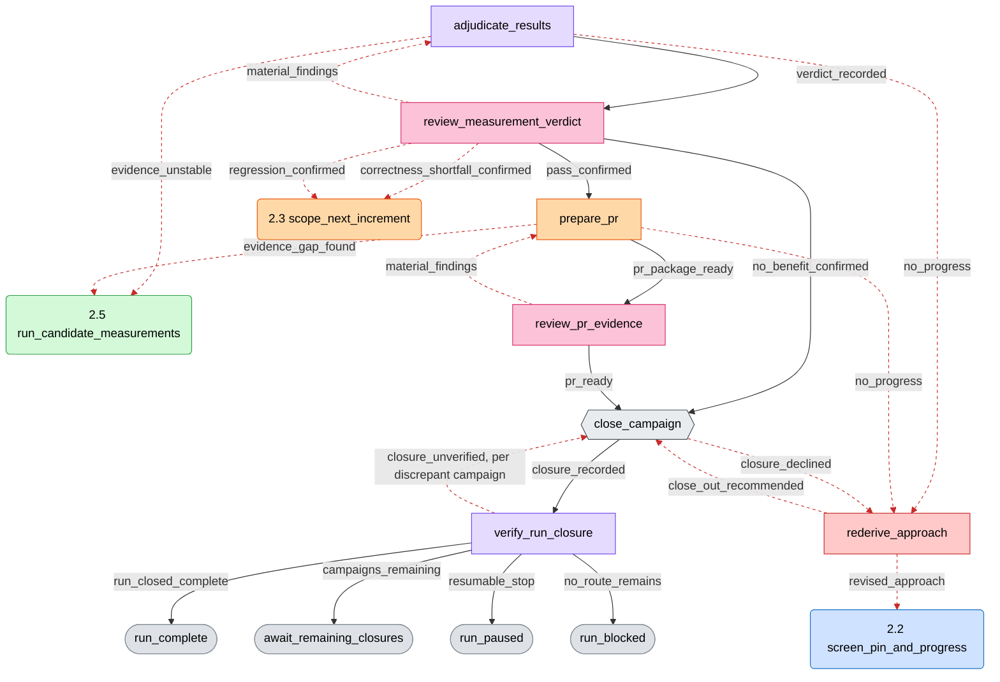

# Plan approval brief — vllm-neuron-parity

Rendered view of the approval bundle. The bundle is the authority; every
section links its source. Verified against the bundle by the retained
plan reviewer (rounds of 2026-08-25, recorded in reviews/plan-review.md)
before presentation.

## 1. Intro

**Goal** (frozen at Stage 1, `requirements.md`): bring the vLLM-Neuron
platform plugin (fork jinhuang12/vllm-neuron) to feature parity with
upstream GPU vLLM — find the gaps, cost them, and close the approved
ones with evidence-backed pull requests, measured against a GPU
baseline. Baseline pin: release-0.24.0.1.1.0; pin values are
invocation-time inputs, so the workflow survives re-baselines.

**Fitness verdict**: fit. Multi-session horizon, parallel campaigns,
three user gates per campaign, and hard authority separation (the seat
that measures never adjudicates; the seat that adjudicates never
measures) — the properties a PAVE graph exists to hold.

**What the workflow does end to end**: scan the upstream delta per
requested target, cost each closing route, rank a backlog, and ask you
to pick campaigns (gate 1). Each approved campaign is designed with
pre-registered acceptance comparators (gate 2), implemented in
CPU-verifiable increments, brought up on leased Neuron hardware,
measured against the GPU baseline, adjudicated, adversarially reviewed,
and closed as an evidence-backed PR to the fork, a no-benefit closure,
or a blocked record (gate 3). Every closure updates the committed
cross-run scorecard, backlog, debt ledger, and failure fingerprints.

**Approving here authorizes**: building the plugin package described in
§3 against the 31-node graph in §2 — nothing else. PR merge stays
human; fork sync stays yours.

## 2. Workflow summary and visual

At a glance — plain-language stage groupings (not graph node ids);
loops and recovery routes omitted here, faithful diagrams below:


Stage boxes are tinted by the agent that dominates the stage (color
key in the legend below).

The full graph has 31 nodes and 89 edges, so it is rendered as six
stage sub-diagrams (per the >25-node split rule). Rectangles are graph
nodes labeled with node ids; hexagons are user gates presented by a node
(gates 1 and 3 — gate 2 is a check on the design_sound edge, so it
appears as edge text in §2.2); stadiums are run endpoints; a rounded
node names the sub-diagram an edge continues in.
Every edge carries its outcome label. Source: `workflow.draft.pave.yaml`.

Color code — node fill = the agent seat that runs the node, as bound
in the §4 table. That is usually the graph's first-listed role, with
two deliberate exceptions: `rederive_approach` carries the dedicated
rederiver seat (an agent binding, not a graph role), and
`verify_run_preconditions` is tinted for its investigating seat rather
than the lead that merely freezes state:

| Color | Agent / meaning |
|---|---|
| blue | investigator (intake, delta scan, costing, design screen) |
| orange | implementer (design drafting, increments, hardware, PR) |
| green | measurer (procedures, baseline, runs, stabilize) |
| purple | adjudicator (verdicts, run-closure verification) |
| pink | adversarial-reviewer (the five review nodes) |
| red | rederiver (approach re-derivation — the recovery seat) |
| gray | lead/user gates, stage-level pointers, and run endpoints |

Dashed red edges are repair and recovery routing — backward re-entry
loops and every route into or out of `rederive_approach`, plus the
`recover_leased_host` loop. Solid edges are the forward path. A
rounded pointer naming a single node carries that node's seat color; a
pointer naming a whole stage stays gray. Styling is presentation only;
the graph stays the authority for nodes and edges.

### 2.1 Intake, delta scan, costing, gate 1



Dashed: the three repair re-entry loops (re-trace deficient targets,
re-assemble on evidence gap, re-cost on material findings).

### 2.2 Campaign design, gate 2



Dashed: the record_incomplete repair fan, review findings re-entry,
and every breaker route into re-derivation.

### 2.3 CPU implementation loop



Dashed: stuck/repair loops and design re-entry; the increment_passed
loop stays solid — it is the stage's normal forward cycle. The design
pointer is blue because its target (screen_pin_and_progress) is
investigator-run.

### 2.4 Neuron hardware bring-up



Dashed: the host-fault/recovery loop and both breaker routes.
recover_leased_host stays implementer-orange — it is a recovery
procedure but an implementer-run node; the recovery LOOP is what the
dashed edges mark.

### 2.5 Measurement vs GPU baseline



Dashed: the three defect re-entry loops and the four budget/breaker
routes into re-derivation.

### 2.6 Adjudication, PR, closure, re-derivation, gate 3



Dashed: verdict/PR findings loops, both no_progress breakers, and the
re-derivation node's own routes (its revised_approach return to design
is the recovery loop closing). The meas/impl/design pointers carry
their target nodes' agent colors.

## 3. File structure

Planned package (source: `skill-package-plan.md` §1) — a Claude Code
plugin, same shape as pave-init:

```
vllm-neuron-parity/
  .claude-plugin/plugin.json           # plugin manifest
  skills/vllm-neuron-parity/
    SKILL.md                           # the lead workflow skill
    hooks/
      protected-branch-guard.sh        # blocks pushes to protected branches
      compile-cache-guard.sh           # blocks Neuron compile-cache clears
      venv-opt-guard.sh                # blocks venv cloning / /opt writes
      state-staleness-reminder.sh      # re-presents run position periodically
      stop-guard.sh                    # blocks a premature stop once
  agents/                              # six role contracts (see §4)
  workflow.pave.yaml                   # canonical graph (frozen at v1)
  workflow-manifest.yaml               # evolving-tier revision lineage
  history/                             # frozen graph revisions
  references/
    artifact-layout.md                 # single authority for artifact shapes
    measurement-pitfalls.md            # known tool traps (built, item 30)
    patch-mechanism-inventory.md       # how the plugin patches vLLM (built)
    collision-ranking.md               # surfaces where ports collide (built)
  schemas/run-state.schema.json        # single authority for run-state shape
  scripts/
    validate_run_state.py              # run-state checker
    validate_pave.py                   # graph checker
    freeze_revision.py                 # evolving-tier freeze tool
  README.md                            # rendered view, never authority
  VERSION                              # package changelog
```

## 4. Specialized agents

Source: `skill-package-plan.md` §2, `traceability.md`.

| Agent | Color (§2) | Role | Model | Key constraint (what it cannot do) |
|---|---|---|---|---|
| (lead = SKILL.md itself) | gray | routing, gates, state writes | session | sole writer of run state and cross-run artifacts; never measures or adjudicates |
| investigator | blue | intake, delta scan, costing, design screen | opus | read-only on the fork; cannot approve its own verdicts |
| implementer | orange | design drafting, increments, hardware attempts, PR package | opus (xhigh on the attempt loop) | never edits comparators; cannot merge PRs; hardware writes confined to lease/venv/worktree scope |
| measurer | green | procedures, baseline capture, runs, stabilize | opus (sonnet at stabilize) | executes what the design record froze — never chooses or alters a comparator; no verdicts |
| adjudicator | purple | verdicts, run-closure verification | opus | never produces the evidence it judges (measurer_not_adjudicator check) |
| adversarial-reviewer | pink | all five review nodes | opus | reviews only; fresh seat per gate round; cannot repair what it reviews |
| rederiver | red | approach re-derivation after breakers | fable, xhigh (user-directed pin, 2026-08-26 — the earlier fable dispatch failure is fixed; on an intermittent spawn 400 the lead retries identically, never downgrades, and after three identical failures pauses for the operator, since an undispatchable seat would dead-end all sixteen recovery routes) | read-only inputs; its output re-enters design, it never implements |

The lead pauses if a `vllm-neuron-parity:*` agent type is unavailable —
it never substitutes an ordinary worker.

Dispatch mechanics (user-directed, 2026-08-26): each node instance's
primary seat runs as a named teammate — background, continuable via
SendMessage, retired when its node instance closes — so a dropped
connection resumes the seat instead of losing its context (doer
seats; reviewer seats stay fresh per gate round). One-shot subagents
remain for a seat's internal fan-out (guardrailed delegate skills,
read-only exploration). Continuity changes, authority does not: the
lead stays the single state writer, teammates never traverse edges
or present gates, forbidden effects inherit into every spawn —
teammate or sub-agent — and a peer message never grants a permission
escalation.

## 5. Hooks and enforcement

Source: `build/enforcement-record.md` (full rung rationale there).
Rungs, weakest to strongest: prose < reinjection < reviewed < mechanical
< blocking hook.

| Rule | Rung | Why that rung |
|---|---|---|
| Never mutate protected branches (release-0.24.*, release-0.21.*, main, mainline) | BLOCKING hook | likely, costly, irreversible, precisely detectable |
| Never clear the shared Neuron compile cache | BLOCKING hook + delegate wrapper | documented remedies include cache-clearing, so delegates will try it; hours of recompile for every tenant |
| No `cp -a` venv cloning; no pip writes into /opt | BLOCKING hook | dead-end pressure makes the shortcut likely; /opt damage breaks co-tenants |
| Zero NxDI imports in ported code | MECHANICAL scan (diff-scoped) | exact over added/modified lines; runs before the review gate |
| GPU baseline read-only; no autonomous reboot; durable-host-state scoping | prose + reinjection + mechanical identity/skew probes | a hook cannot see remote SSH side effects; capture refuses on contradiction |
| Benchmark skill's provisioning STOP gate never removed | prose + reinjection | text edit, cheap to catch at review, reversible |
| PRs only to the fork; merge stays human | MECHANICAL (PR URL verified on the fork) + capability absence | merge authority is never granted — stronger than any check |
| No identical hardware retry | MECHANICAL fingerprint gate | fingerprint equality is exact; pre-attempt precondition |
| Comparators frozen before measurement | MECHANICAL timestamp check | registration-timestamp arithmetic is exact |
| Lead single-writer for run state, cross-run artifacts, leases | STRUCTURE + schema validation | ownership-by-structure beats detection; budgets are derived from files, never stored |
| Measured revision = git-issued id, never a branch name | MECHANICAL check | exact string-shape + agreement test |
| Two-tier repair budgets and breakers (measure three/nine; hardware ten + one recovery) | BLOCKING routing preconditions | counts derived from event files; runaway loops are the costliest failure |
| Lead-alignment hook pair (staleness reminder + stop guard) | reinjection | long-horizon, session-crossing workflow — the pair's target case; the stop guard **blocks a stop once**, disclosed in the skill description |
| New kernel-class functionality must be NKI, never torch fallback (kernel-substrate rule, user-directed 2026-08-26) | MECHANICAL (every increment must declare kernel-class or not — no silent omission; a declared-NKI increment with zero NKI usage in its diff is an exact contradiction caught at the changeset scan) + REVIEWED (both gates challenge the classification itself) | "what is kernel-class" is judgment no scan decides, and absence-of-torch scans false-fire on kernels' legitimate torch boundaries — so the mechanical half checks presence against the doer's own declaration, and review owns only the classification |

The enforcement record carries 13 run-wide prohibitions and 6 transition
guards in total; this table shows the strongest rows, and every rule not
shown sits at a weaker rung with its rationale in the record. No
settings fragment is required — every hook registers at skill
frontmatter scope. Nothing registers silently.

## 6. Tradeoffs and open decisions

- **Simplest-graph choices**: one flat profile (no child packaging);
  scheduling-conflict machinery (item 21) dropped — surface-overlap
  holds are a lead procedure, not graph structure; state carries no
  counters (budgets and allowances are recomputed from event files).
- **Suggested magnitudes**: the loop bounds (three/nine repair passes,
  ten hardware attempts, two bring-up retries, one recovery per host)
  ship in contract text as "suggested" values — operator-tunable at
  re-derivation, single authoritative definition in the artifact-layout
  reference.
- **Evolving tier approved**: the revision workspace ships; update runs
  start from the frozen active revision, never the draft.
- **Accepted residuals** (recorded, reviewed, not fixed): the
  `baseline_unusable` outcome name also covers a design-side digest
  mismatch first surfacing at capture (routing is right; a rename
  ripples further than the imprecision costs); a measurer could reach
  budget exhaustion by filing redundant defect records — accepted at
  the reviewed rung because the escape buys the doer more work and
  leaves a recomputable signature the re-derivation seat can see.
- **Evidence gaps carried forward**: the in-repo accuracy
  orchestration tier is unread (a capability dead end there routes out
  through `procedure_unrealizable`); upstream-source sizing is
  observational (~10 targets), disclosed in the delta-scan contract.
- **What you accept rather than approve**: the acceptance machinery
  itself is NEW CONSTRUCTION — the correctness gate (lm_eval parity,
  greedy token-match) and the performance gate against the GPU baseline
  have been run once, forensically, by hand, never as a repeatable
  procedure (the system map's load-bearing gap); the measurement stage
  builds that shared validation back-end during the first campaign, so
  approving the plan accepts that its central gate mechanism does not
  exist yet. Also accepted: leased-hardware cost of the
  attempt/measurement loops up to their declared bounds; the fork PR
  as the only shipping vehicle (upstreaming stays out of scope).

## 7. Appendix — the raw bundle

- `requirements.md` — frozen user requirements and assumptions.
- `system-map.md` — the explored system: fork, plugin, baselines,
  hosts, benchmark skill.
- `workflow.draft.pave.yaml` — the graph itself (31 nodes, 89 edges,
  12 checks, 24 evidence definitions, 5 endpoints; validates clean).
- `traceability.md` — every graph object mapped to the package element
  that realizes it.
- `skill-package-plan.md` — package layout, role-to-agent map, build
  units, evolution contract.
