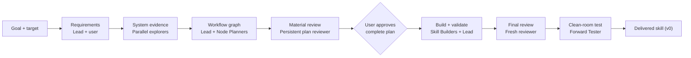
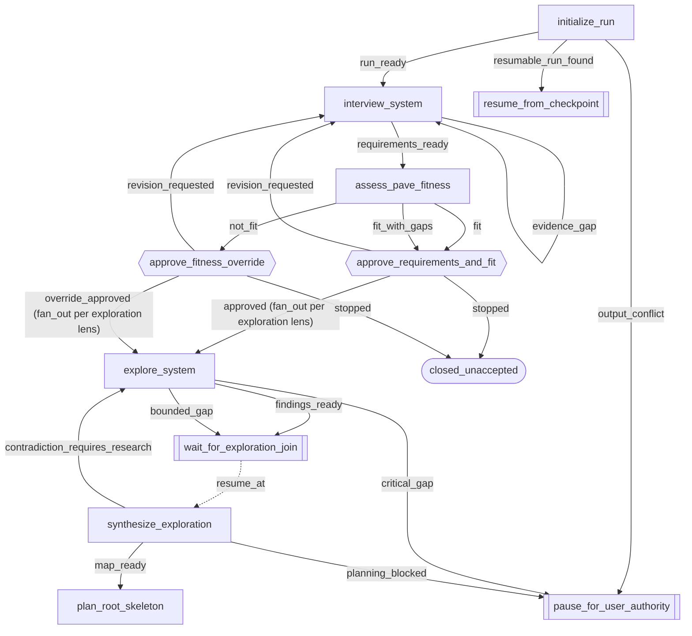
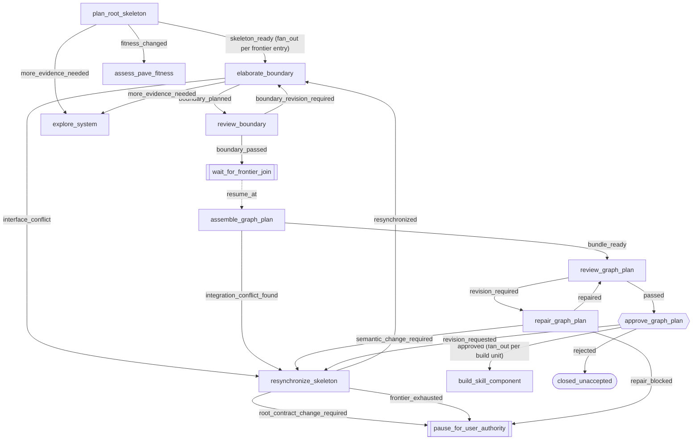
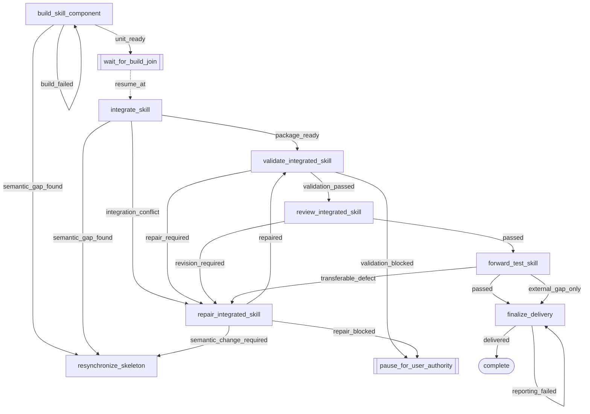

# PAVE Init

Version: `2.4.2`

Turn a goal into a reviewed workflow and a ready-to-use native harness plugin: a lead workflow skill plus role agents. Claude Code uses registered Markdown agents. Codex uses custom-agent TOML and an explicit agent installer. Each generated package documents its native installation path.

You provide the outcome and target system. `pave-init` investigates the system,
designs the workflow, reviews it, builds the skill, tests it, and reports any
limits it could not resolve.

## Start here

Invoke the skill with one sentence:

```text
/pave-init turn <goal> for <target system> into a workflow skill
```

Example:

```text
/pave-init create a skill that ports an existing vLLM GPU model to
vLLM-Neuron and verifies functional equivalence
```

You do not need to design the workflow first. The skill inspects available
sources before it asks questions. It asks only when your answer can change the
scope, authority, allowed changes, routing, or acceptance criteria.

`pave-init` is manual-only. It runs only when you invoke `/pave-init`.

## What you provide

| Required | Meaning |
|---|---|
| Goal | The result you want. |
| Target | The repository, system, process, or source the workflow applies to. |

You can also state exclusions, required evidence, allowed changes, or a target
skill location. If you omit them, `pave-init` inspects the target and proposes
safe defaults for approval.

## What you receive

| Output | Purpose |
|---|---|
| `requirements.md` | The approved goal, scope, evidence, authority, and acceptance rules. |
| `system-map.md` | Verified system structure, current workflow, gaps, and constraints. |
| `workflow.draft.pave.yaml` | The complete, untried v0 workflow graph. |
| `*.draft.pave.yaml` | Child graphs used only when a node needs material decomposition. |
| `workflow-manifest.yaml` | Workflow revision state: the v0 draft, no active revision at delivery. |
| `traceability.md` | Links graph objects to their skill implementation. |
| `skill-package-plan.md` | The approved file tree, build ownership, enforcement record, and evolution tier. |
| Generated plugin | The validated plugin package (manifest, registered role agents, lead skill) that implements the approved graph. |
| Generated `README.md` + `VERSION` | A deep-dive rendered from the approved bundle (intro, at-a-glance plus faithful Mermaid visual, file tree, agents, hooks, appendix) plus a package changelog seeded at `1.0.0`. |

For a repository target, planning files live under:

```text
<repository>/.pave/<workflow-name>/
```

## Your two approval gates

| Gate | What you decide | What happens next |
|---|---|---|
| 1. Requirements and fitness | Confirm the goal, assumptions, scope, and whether PAVE fits. | Independent system exploration starts. |
| 2. Complete plan | Confirm the graph, evidence, authority, enforcement record, package tree, and known gaps. | Skill construction starts. |

At each gate you decide from a rendered **approval brief**, not from the raw
YAML and plan files. Before you see the plan brief, an adversarial reviewer —
an independent agent whose job is to find real, material defects — verifies it
against the underlying artifacts (`references/approval-briefs.md`).

After Gate 2, validation, final review, and the clean-room test run
automatically. There is no third approval gate.

## At a glance

A simplified happy path. The vertices here are stage groupings, **not** graph
node ids — the canonical graph is
[`references/pave-init.pave.yaml`](references/pave-init.pave.yaml), rendered
faithfully in the next section.



## The canonical graph, rendered

Rendered from [`references/pave-init.pave.yaml`](references/pave-init.pave.yaml):
22 nodes, 7 control endpoints, 61 edges. One diagram that size is unreadable,
so it is split into three stage diagrams (split rule:
[`references/approval-briefs.md`](references/approval-briefs.md)). Every
declared edge appears in exactly one diagram. A node drawn in two diagrams is
the same node, repeated where a later stage routes back into it.

Legend: `[rectangle]` graph node · `{{hexagon}}` user gate (`roles` include
`user_authority`) · `([stadium])` terminal endpoint · `[[subroutine]]`
non-terminal control endpoint (join, pause, return) · solid arrow labeled with
the outcome code that traverses that declared edge · dotted arrow = the
endpoint's declared `resume_at`, not an edge.

### Stage A — goal, fitness, exploration



### Stage B — planning, review, plan approval



### Stage C — build, validation, forward test, delivery



Two control endpoints resume dynamically and therefore have no drawable
target: `pause_for_user_authority` resumes the node that paused, and
`resume_from_checkpoint` reopens the node or edge after the last satisfied
check in the recorded traversal history. Both are declared in
[`references/pave-init.pave.yaml`](references/pave-init.pave.yaml).

## File structure

```
<plugin-root>/                            # installed as the pave-init plugin
├── .claude-plugin/plugin.json             # Claude Code manifest
├── .codex-plugin/plugin.json              # Codex manifest
├── agents/                                # generated Claude Code role definitions
│   ├── system-explorer.md                # investigates one angle of the system; writes only its own report
│   ├── node-planner.md                   # one-boundary planning authorship
│   ├── pave-material-reviewer.md         # adversarial method + materiality and severity contract, both gates
│   ├── research-delegate.md              # the reviewer's evidence-gathering sub-agent
│   ├── skill-builder.md                  # scoped package construction + workflow-script compile mapping
│   └── forward-tester.md                 # clean-room skill use
├── codex/agents/                          # generated Codex custom-agent contracts
├── codex/skills/pave-init/SKILL.md        # generated native Codex lead
├── sources/                               # shared workflow and role sources + harness bindings
└── skills/pave-init/
    ├── SKILL.md                          # lead contract: stages, gates, state duties, hook registration
    ├── README.md                         # this rendered view of the package
    ├── VERSION                           # package changelog
    ├── orchestration/
    │   ├── interview-and-fitness.md      # Stage 1 procedure and approval gate (lead-run)
    │   ├── explore-and-plan.md           # Stages 2-3 procedure, incl. the planning-frontier procedure
    │   └── review-and-build.md           # Stages 4-6 procedure and gates
    ├── references/
    │   ├── pave-init.pave.yaml           # THE canonical graph of pave-init itself
    │   ├── pave-init-traceability.md     # graph object -> implementing file map
    │   ├── pave-yaml.md                  # the PAVE YAML contract
    │   ├── pave.schema.json              # the PAVE JSON Schema
    │   ├── pave-spec.md                  # THE PAVE design language: vocabulary, node sizing, patterns, smells
    │   ├── technique-selection.md        # when debate / monitor / audit / ledger earn their cost — and when they hurt
    │   ├── pave-composition.md           # child-profile contract and depth-2 cap
    │   ├── pave-composition.schema.json  # composition schema
    │   ├── pave-revisions.md             # v0/v1+ revisions and evolution tiers
    │   ├── lead-alignment-hooks.md       # hook doctrine + default pair: invariants, omission conditions, templates
    │   ├── planning-layout.md            # planning/ write ownership, precedence, prohibited patterns
    │   ├── approval-briefs.md            # approval-gate briefs and delivered README/VERSION
    │   ├── workflow-minimal.pave.yaml    # the validating floor graph — default planner starting point
    │   └── workflow-template.pave.yaml   # construct showcase, sent only when the goal names branching/recovery/fan-out
    ├── schemas/
    │   └── run-state.schema.json         # single authority for pave-init's own run-state shape
    ├── scripts/
    │   ├── validate_pave.py              # graph validator (follows composition references)
    │   ├── validate_traceability.py      # traceability-row checker
    │   ├── validate_run_state.py         # run-state instance checker (stdlib fallback; --frontier mode)
    │   ├── freeze_revision.py            # v1+ freeze / verify / rollback derivation
    │   ├── measure_artifact.py           # living-document size vs its §8.4 cap; shipped with capped generated plugins
    │   ├── transcript_filter.py          # advisory-monitor read side: incremental .jsonl digest (reference impl)
    │   └── test_validate_pave_composition.py  # validator tests
    ├── evaluations/                      # eval scenarios: multi-boundary port, trivial single node, resume
    ├── hooks/
    │   ├── _find_run_state.sh            # marker-first run-state discovery (a scan hit is not ownership)
    │   ├── stop_alignment_check.sh       # Stop: asks alignment questions; blocks at most 1 stop in 3
    │   ├── state_staleness_reminder.sh   # PostToolUse: throttled observing staleness nudge
    │   ├── planning-layout-warn.sh       # PostToolUse: non-blocking planning-layout warning
    │   └── write_for_reader.sh           # PostToolUse: §8.5 reader reminder; sizes an over-cap document past its throttle
    └── tests/
        ├── test_hooks.sh                 # invariant tests for every shipped hook and its registration
        ├── test_validate_run_state.py    # validator parity and warn-only cap tests
        ├── test_measure_artifact.py      # size instrument tests
        └── test_doc_budget.py            # pave-init's own documents against pinned ceilings (a ratchet)
```

## How recursive planning stays manageable

Planning is divided into boundaries. A boundary is one parent node plus its
immediate children. The lead freezes the top node's contract, then dispatches
one Node Planner per open boundary; the open list — the frontier — lives in
`planning/frontier.yaml`. Each planner sees one frozen parent contract and one
level of children, so independent boundaries plan concurrently, and the
persistent plan reviewer checks each boundary as it closes. Packaging a node
as its own child graph is capped at depth 2 (`references/pave-composition.md`);
decomposition itself has no depth limit — it stops when the one-agent test
passes (`references/pave-spec.md` §9.12): a node is atomic when one agent can
achieve and verify its goal in one bounded context; otherwise decompose it and
re-test the children. A simple
goal closes the queue after the root's single entry, with no extra ceremony. Full procedure:
`orchestration/explore-and-plan.md` §4.

## Enforcement and hooks

Prose instructions fade as a long run consumes context. So every run-wide
prohibition gets a recorded enforcement strength, and a rule that must outlive
its prose maps to a hook (`references/pave-spec.md` §9.14; mechanics in
`references/lead-alignment-hooks.md`). Three defaults follow, each keyed to a
structural property and each omitted only by a recorded omission condition:
the lead-alignment hook pair when a lead routes a long-horizon run, one
machine-checkable schema when state must survive a session boundary, and a
layout reference when more than one role writes artifacts.
`pave-init` applies all of this to itself: it registers the lead-only hook
pair in its own frontmatter, its two subagent-facing hooks (planning layout,
write-for-the-reader) in the plugin's `hooks/hooks.json`, and persists its own
run state (`run-state.json`, validated by `schemas/run-state.schema.json`).

## Workflow revisions

| Version | Meaning |
|---|---|
| `v0` | The reviewed, approved draft. Delivered by `pave-init`. Untried. |
| `v1` | First immutable revision, frozen immediately before the first real execution — never by delivery, never by clean-room testing. |
| `v2+` | Immutable successors from usage evidence or approved changes. |

History is append-only, and each generated skill records one reviewed
evolution tier — `static` (default) or `evolving`. The rules are in
`references/pave-revisions.md`.

## Who does what

| Role | Owns | Cannot do |
|---|---|---|
| Lead | Root contract, planning frontier, assembly, shared files, integration, and delivery. | Approve the plan for the user; redesign a boundary itself. |
| Requirements Interviewer (lead-run) | Goal clarification and the requirements record. | Design the graph before requirements approval. |
| System Explorer | One bounded evidence question. | Edit shared approval files or propose the complete graph. |
| Node Planner | One parent boundary and one level of children; the root skeleton on root dispatch. | Change ancestor or sibling interfaces or write approval artifacts. |
| Material Reviewer (plan gate) | Root skeleton, each boundary, and the whole bundle — one persistent named reviewer. | Author the artifact under review or block on style preferences. |
| Material Reviewer (final gate) | The integrated skill — a fresh identity, never the plan reviewer. | Inherit the plan reviewer's conclusions. |
| Skill Builder | One approved, non-overlapping file set. | Change graph meaning, add unrecorded hooks, or ship unrecorded evolution machinery. |
| Forward Tester | A clean-room use of the generated skill at session defaults. | Receive the expected answer or mutate the live system. |
| User | Requirements, fitness override, and complete-plan approval. | No implementation work is required. |

## When the workflow finds a problem

| Problem | Route |
|---|---|
| Missing evidence | Return to focused exploration. |
| Parent or child interface conflict | Resynchronize the root skeleton; stale boundaries replan. |
| Material review finding | Repair the exact reviewed artifact and review it again. |
| Builder finds a semantic gap | Resynchronize the narrowest affected boundary. |
| Validation failure | Repair the integrated skill and rerun validation. |
| Clean-room test finds a transferable defect | Repair, validate, review, and test again. |
| External system capability is unavailable | Report the gap without claiming success. |

Only verified `BLOCKING` and `HIGH` review findings stop progress. Unsupported
findings, style preferences, and speculative risks do not change the workflow.

## Version meanings

The package version in [`VERSION`](VERSION) tracks releases of `pave-init`
itself. The workflow revision labels above (`v0`, `v1+`) belong to each
generated workflow and are separate from the package version.

## Source of truth

- [`SKILL.md`](SKILL.md) contains the executable instructions.
- [`references/pave-init.pave.yaml`](references/pave-init.pave.yaml) contains
  the canonical workflow graph.
- [`references/pave-yaml.md`](references/pave-yaml.md) defines the PAVE YAML
  contract.
- [`references/pave-spec.md`](references/pave-spec.md) is the PAVE design
  language: core vocabulary, node sizing, patterns, enforcement spectrum, and
  design smells.
- [`references/pave-composition.md`](references/pave-composition.md) defines
  the composition contract and the depth-2 cap.
- [`references/pave-revisions.md`](references/pave-revisions.md) defines
  workflow revisions and the evolution tiers.
