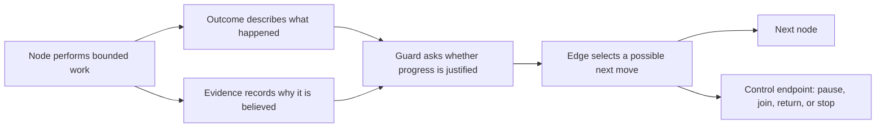

# PAVE: Patterns for Agentic Verifiable Engineering
 
**Version:** 0.3
**Status:** Official working specification
**Purpose:** A pattern language for graph engineering
**Pairs with:** PAVE YAML 0.3.0 ([`pave-yaml.md`](pave-yaml.md)) — the two version numbers track different contracts (design doctrine here, document format there) and move independently; this line records the tested pairing

## Contents

1. What PAVE is
2. What graph engineering means
3. What verifiable means
4. PAVE philosophy
5. Core graph vocabulary — node contract §5.1, evidence §5.3, acceptance evidence ladder §5.3.1, guard §5.4
6. PEER node intents
7. Roles and perspectives
8. State and external memory — document budget §8.4, written for the reader §8.5
9. Reusable graph patterns — enforcement rungs §9.14, node sizing §9.12, porting §9.12.2
10. How to engineer a graph with PAVE
11. Lightweight design canvas
12. Worked example: AMMO GPU optimization
13. Common graph-design smells
14. PAVE design review

## 1. What PAVE is
 
PAVE helps a person or agent design an engineering workflow as a graph.
 
The graph makes the structure of the work visible:
 
- what work occurs;
- what each piece of work produces;
- what can happen next;
- what evidence supports progress;
- who acts and who reviews;
- how the workflow responds to uncertainty and failure;
- what the workflow remembers; and
- how the workflow decides to stop.
PAVE is a set of guiding principles, design patterns, and shared terms. It is
not a workflow runtime, file format, certification system, or mandatory
process. A workflow can use the patterns that fit its risks and goals.
 
PAVE calls a workflow **PAVE-informed** when its design uses this language to
make important decisions explicit. There is no conformance claim.
 
### 1.1 This document and its reference profile
 
This document defines meaning. It does not define syntax.
 
A team that wants a machine-checkable file format can use a **reference
profile**: a document that fixes a schema, an identifier grammar, and
validity rules for a specific serialization. `pave-yaml.md` and
`pave.schema.json` are one such profile.
 
Keep the two separate. A change of syntax is a profile change. A change of
meaning is a change to this document.
 
## 2. What graph engineering means
 
Graph engineering is the deliberate design of how work progresses, branches,
loops, remembers, and earns confidence.
 
A graph is more than a diagram of tasks. Its design includes:
 
1. **Work:** the operations that change knowledge or the system.
2. **Choice:** the outcomes that create different possible paths.
3. **Confidence:** the evidence and judgment used before progress.
4. **Authority:** the roles that may act, challenge, decide, or promote.
5. **Memory:** the state that must survive between nodes and sessions.
6. **Recovery:** the paths used after failure, doubt, or invalid evidence.
7. **Completion:** the reasoning used to continue, stop, or escalate.
The purpose of graph engineering is to turn an implicit agent loop into an
inspectable workflow. The graph should help its designers answer why the work
moved from one activity to another.
 
### 2.1 The four layers
 
PAVE separates workflow meaning from execution technology. Four layers
carry that separation.
 
| Layer | What it is | Responsibility |
|---|---|---|
| **Design guide** | This document | Meaning, principles, patterns, and review questions |
| **Graph Profile** | One graph definition | The workflow graph and its domain policy |
| **Runtime Binding** | Runtime code, configuration, or a declared extension | Actor assignment, persistence, hooks, scheduling, resource isolation, parallel dispatch |
| **Workflow Run** | Live state and evidence artifacts | One execution of the Graph Profile |
 
Most design arguments become easy once the layers are named. Ask which layer
a question belongs to before answering it.
 
- Which model or person performs a node? Runtime Binding.
- Whether a node exists at all? Graph Profile.
- Where evidence is stored? Runtime Binding.
- What evidence a decision requires? Graph Profile.
- Which instrument answers a node at each entry — a lead-run mechanical check,
  a seat dispatched only when a named trigger fires, or a full seat? Runtime
  Binding: declared per node at design time, chosen per traversal. A node
  whose common-path outcome any reader re-derives from persisted inputs takes
  the lead-run check whatever role its parent carries; a judgment bundled
  with that path is its own conditional seat, never averaged into one medium
  seat. Tiers bind to roles; instruments bind to nodes — a child inherits its
  parent's roles, never a seat.
- How many workers run one node? Runtime Binding.
- Whether the work has distinct sub-goals? Graph Profile.
The last pair matters most. "Too much work for one agent" has two different
fixes. Decompose the graph when the work has distinct sub-goals that need
their own outcomes, evidence, or recovery. Use the Runtime Binding when the
work is one goal executed by many hands. Do not add graph structure to solve
a labor problem the binding already solves.
 
### 2.2 Topology is fixed during a run
 
The graph is designed, reviewed, and then executed. A run traverses the
graph. It does not rewrite it.
 
When execution reveals that a node was sized wrong, the node reports an
outcome that says so, and the graph routes that outcome back to planning
work. The redesign happens as a design activity with its usual review, not
as a silent edit inside a running node. Bound that loop (§9.8), so a
run cannot oscillate between planning and execution forever.
 
## 3. What verifiable means
 
In PAVE, **verifiable** means that an important claim can be inspected,
questioned, and reconstructed.
 
Verification can use:
 
- direct observations;
- source inspection;
- logs and traces;
- experiments;
- tests and benchmarks;
- structured or unstructured artifacts;
- comparison with an incumbent system;
- Socratic LLM review;
- independent agent judgment; or
- human judgment.
PAVE does not assume that every claim has a deterministic test. Some questions
are semantic, incomplete, or expensive to reduce to code. The workflow should
make the basis of the judgment visible even when the judgment remains
qualitative.
 
Evidence that carries an acceptance decision is held to a stricter bar than
evidence used to inform work. §5.3.1 states it.
 
A useful verification exchange asks:
 
1. What claim is being made?
2. What evidence supports it?
3. What assumptions connect the evidence to the claim?
4. What evidence would weaken or disprove it?
5. Is the evidence about the current system and current target?
6. Is another perspective needed?
7. Is the remaining uncertainty acceptable for the next action?
## 4. PAVE philosophy
 
### 4.1 Give work a clear purpose
 
Each part of the graph should answer one clear question or perform one clear
kind of work. A node that mixes unrelated purposes is difficult to review and
difficult to recover.
 
### 4.2 Make uncertainty visible
 
An engineering graph should represent uncertainty as a normal state. It can
route uncertainty to more exploration, a new plan, a bounded experiment, or an
independent review.
 
### 4.3 Let evidence inform movement
 
Progress should have a stated reason. The reason can be a measurement, an
artifact, a review, or a justified judgment. Stronger consequences usually
need stronger evidence.
 
### 4.4 Separate creation and challenge when useful
 
The same actor can plan and execute simple work. Consequential claims often
benefit from another perspective. Separation is a tool for reducing blind
spots, not a universal staffing rule.
 
A challenger is also a source of failure. See §9.4.
 
### 4.5 Design failure as a path
 
Failure should lead to a useful next activity. Common routes include repair,
new exploration, replanning, rollback, a different mechanism, or escalation.
 
### 4.6 Make parallel work converge
 
Parallel work needs an explicit join. The graph should say when results are
ready to combine and how the combined system will be reviewed.
 
### 4.7 Preserve the memory that later work needs
 
Agents and people lose context. A graph should externalize the facts,
decisions, and evidence that later nodes require.
 
Two different things decay, and they need different answers.
 
**Knowledge decays across a boundary.** A later node cannot see what an
earlier node knew. The answer is external memory: write the facts down at a
declared location, and let the later node read them. §8 covers this.
 
**Instructions decay inside one actor.** A long-running agent follows its
contract until that contract leaves its context window. Nothing is disobeyed.
The rule simply stops being present. Repeating a rule more loudly at the
start does not help, because the start is what gets dropped.
 
The answer to the second kind is reinjection at the moment the rule binds.
Put the reminder where the decision happens, not where the run begins. A rule
that must hold on every action of a long run needs a mechanism that fires on
every action. A rule that one transition evaluates needs no such mechanism,
because the graph raises it while the instruction is still fresh.
 
Design for decay. It is the normal condition of a long-horizon run, not a
defect in the actor.
 
### 4.8 Design how the graph stops
 
Completion is part of the workflow. A graph can stop through measurement,
judgment, budget, exhaustion, risk, or human authority. The stopping basis
should be visible, and so should the meaning of the stop. See §9.13.
 
### 4.9 Match enforcement to consequence
 
Some rules need only a reminder. Others need independent review, durable
state, or a blocking mechanism. The cost of a violation should guide the
strength of enforcement.

The companion document `technique-selection.md` (shipped beside this spec)
describes battle-tested review and evidence techniques, with the conditions
under which each earns its cost and the conditions under which it hurts.
 
### 4.10 Improve the graph from operational experience
 
Repeated failures reveal missing nodes, weak evidence, unclear edges, or
insufficient review. A graph is an engineered system and can improve over
time.
 
Approval and maturity are different things. A reviewed graph is a considered
design that nobody has run yet. Give the two states different names and
different authority:
 
- A **draft** is editable. It carries design authority only.
- A **frozen revision** is immutable. It records the graph and the evidence
  that stood behind it at the moment it froze.
Freeze immediately before first real execution, not at approval. Later
revisions succeed earlier ones and record what changed and why. Version
numbers record succession, not quality.
 
### 4.11 Use the smallest sufficient graph
 
The simplest graph that achieves the goal is the best graph.
 
Every pattern in §9 sounds prudent in isolation. Applied together without a
counterweight, they produce a workflow that costs more to operate than the
work it governs. This principle is that counterweight.
 
- Start with the shortest valid path from purpose to completion.
- Add a node, role, seat, edge, loop, state field, reviewer, or control only
  for an approved requirement or a credible material failure.
- Prefer one existing gate over a second gate that checks the same claim.
- Remove any element whose absence does not change required routing,
  authority, evidence, recovery, or acceptance.
- Compare the cost of the added structure with the risk it removes — priced
  over the traversals its loops and re-entry edges can carry, not the first
  pass alone; a node on a loop states its expected traversal count, and a
  seat on it costs that count times one dispatch.
The burden of proof is on adding structure, never on staying simple.
 
## 5. Core graph vocabulary
 
PAVE uses six core terms: **Node**, **Outcome**, **Evidence**, **Guard**,
**Edge**, and **Control endpoint**.
 

 
These terms are design tools. PAVE does not require a specific schema or
serialization.
 
### 5.1 Node: bounded work
 
A **Node** is one bounded unit of work: a goal, plus the smallest contract that
lets one actor achieve that goal and prove it. A node is not a task, a step, or
a tool call.
 
The contract has five parts:
 
| Part | What it fixes |
|---|---|
| Purpose | The goal: the result this node is responsible for, and what is out of scope |
| Inputs | Everything the node consumes; each one already exists or a sibling produces it |
| Effects | What the node creates, what it may change, and what it must not touch |
| Outcomes | Every way the run can end (§5.2); the one that means success carries the definition of done |
| Roles | The perspectives that act (§7) |
 
The **definition of done** is the success outcome's contract, written as one
statement: *condition — settled by act on world-produced evidence*. A condition
that nothing can settle is not a definition of done (§3).
 
Two failures make a node unready to build on. You can state the condition but
cannot name an act that settles it. Or the only thing the act reads is the
actor's own report that the work is done. Success is acceptance-bearing, so its
evidence comes from the world — a file, command output, a measurement, or a
verdict from someone who did not do the work — and never from the doer's
assertion. §5.3.1 gives the two rungs and the one exemption.
 
A **node run** is one attempt at the goal, and a run ends by reporting exactly
one declared outcome. Only the settling act selects the success outcome; every
other outcome names a situation that ends the run without that claim.
 
The actor settles it; because the evidence persists (§5.3), a reviewer who did
not do the work can re-run the act and reach the same verdict — the guard on
the success edge (§5.4) is that re-settling built into the graph. A definition
of done a reviewer cannot re-settle from the artifacts is not verifiable (§3).
 
Intent is a derived label, not a sixth decision. Choose PEER (§6) by reading
the purpose; it fixes authority and perspective and catches a node that mixes
unrelated work.
 
A reference profile need not give every part its own field. In `pave-yaml.md`,
purpose, intent, roles, and outcomes are node fields; effects are
`allowed_effects`, `forbidden_effects`, and `produces`; and the definition of
done lives on the success outcome as the evidence it requires (§5.3) and a
check (§5.4). The parts are the meaning, not the syntax.
 
Example:
 
```text
Node: Capture clean baseline
Purpose: Establish the incumbent's timing on the frozen workload.
  Out of scope: explaining the timing; changing the workload.
Inputs: Frozen workload contract, incumbent revision
Effects: Creates a timing record and a golden output; may run the workload;
  may not modify the incumbent
Outcomes:
  - baseline_credible: three runs fall within a 2% spread — settled by
    comparing the three times in the timing record the runs wrote
  - baseline_invalid: the spread exceeds 2%, or a run failed
Roles: Observer
```
 
A node should be split when it combines conflicting responsibilities. For
example, implementation and independent approval are clearer as two nodes.
 
Write the contract before deciding how the node is realized: a part you can
fill only vaguely means the goal is not ready to size. Whether one agent can
achieve it is a separate feasibility judgment — §9.12.
 
**Steps are not nodes.** A sequence of actions inside one node is an
*activity list*. Actions become separate nodes only when they need their own
outcomes, evidence, authority, recovery route, or resume point. Splitting for
tidiness adds routing cost and buys nothing. §9.12 gives the sizing
procedure.
 
### 5.2 Outcome: what happened
 
An **Outcome** describes the result of a node.
 
An outcome names the situation. It does not name the destination.
 
Examples:
 
```text
baseline_captured
baseline_invalid
candidate_ready
candidate_failed
review_passed
review_needs_evidence
integration_conflict
opportunity_exhausted
```
 
This separation lets the graph respond to the same outcome in different ways
when the surrounding state changes.
 
Two rules keep the separation real:
 
1. **An outcome never encodes or invokes its destination.** Edges own
   routing. A node that decides where to go next has absorbed the routing
   table, and the graph can no longer be reasoned about as a graph.
2. **Every nonterminal outcome has at least one outgoing edge.** An outcome
   with nowhere to go is a dead end that only appears at run time, usually
   during the failure it was written to describe. This rule is cheap to check
   and removes a whole class of design defect.
3. **Exactly one outcome means success, and it is acceptance-bearing.** Its
   condition and settling act are the node's definition of done (§5.1), and
   §5.3.1 sets its evidence bar. An outcome that only routes control needs no
   evidence.
### 5.3 Evidence: why the graph believes it
 
**Evidence** is information used to support or challenge a claim.
 
Evidence can be raw, derived, or judgment-based:
 
- **Observed evidence:** output, logs, traces, source snapshots, measurements.
- **Derived evidence:** comparisons, summaries, calculations, diagnoses.
- **Judgment evidence:** critiques, audit findings, decisions, or assessments.
Useful evidence records:
 
- what claim it concerns;
- where it came from;
- what system revision it describes — the immutable identifier actually read
  at capture: a commit, a content digest, an etag, an object timestamp. A
  branch name, `HEAD`, `main`, or `latest` names whatever was there at a
  moment nobody recorded; capturing against a moving ref is an effect
  violation recorded at the producing node, not a gap for a later round to
  argue about. Re-observation stays a right; recording what was observed is
  the duty;
- what target or conditions applied;
- what assumptions were used; and
- whether later changes can make it stale.
Evidence can be a file, database record, issue comment, conversation artifact,
or another durable reference. The format should fit the workflow. Prefer
pointing at a standing document over minting a new file per outcome or per
round; §8.4 sets the document budget.
 
#### 5.3.1 Acceptance evidence ladder
 
Evidence for an acceptance-bearing outcome is produced by the world, not
asserted by the actor that did the work. Two rungs; use the highest that
honestly fits.
 
1. **Measurement against a declared threshold.** Command output, test result,
   benchmark, or metric. The threshold is part of the acceptance condition:
   "latency measured" verifies nothing, "p50 at or below baseline minus ten
   percent" does. The doer may run the measurement, because the value comes
   from the instrument and not from its judgment.
2. **Judgment against a rubric written in advance.** For a qualitative
   property that has no honest measurement — an LLM judge or a human reviewer
   is the same rung. Three conditions: the rubric exists before the work and
   was not authored by the actor whose work it will judge, the judge is not
   the doer, and rubric and verdict both persist. Missing any one makes it an
   opinion rather than evidence. Author-written criteria are how a proposal
   grades itself through an independent judge (§9.2).
Doer self-report sits below the ladder. It is never the sole evidence for an
acceptance decision.

When the doer itself writes an acceptance-bearing artifact, bind it to the
world: record an identifier the doer cannot mint — a job id, commit hash, or
run id issued by the executing system — and persist that identifier in a
second artifact the doer does not write, so the claim traces to the run that
produced it. An artifact whose provenance rests only on the doer's own text
is a self-report regardless of its format.
 
Scripts own derived numbers. A number computed from evidence — a speedup, a
pass rate, a diff count — comes from a deterministic script, and the artifact
that carries it records the recompute command. A number an actor derives by
hand can err or drift toward the answer it wants, and nobody can re-check it
cheaply.

Two guards keep the ladder from backfiring. A metric that does not measure the
acceptance property is as much a defect as missing evidence, so do not invent
numbers to reach rung 1. And the ladder binds acceptance-bearing evidence only.
Every node's definition of done is acceptance-bearing (§5.1). A control-flow
outcome with a self-explanatory code is not, needs no evidence, and demanding
it everywhere trains designers to manufacture artifacts.
 
### 5.4 Guard: should the graph proceed?
 
A **Guard** is a question or condition considered before an edge is followed.
 
Examples:
 
```text
Is the baseline credible?
Is the proposed change grounded in the observed gap?
Did all relevant parallel tracks finish?
Has another perspective challenged the result?
Does the evidence describe the current candidate revision?
Is the remaining uncertainty acceptable?
```
 
A guard can be evaluated by an active agent, a separate reviewer, a Socratic
dialogue, a human, a script, a hook, or a test. §9.14 covers how to choose.
 
A guard on an outcome's only edge is a designed stop when it fails: the
design names the route the run takes instead, and a terminal destination
carries its status. A stop with no declared destination strands the run at
exactly the moment judgment said "do not proceed". The reference profile
makes this mechanical (`pave-yaml.md` §9, `on_failure_route`).
 
### 5.5 Edge: how the graph responds
 
An **Edge** is a possible movement from one node to another node or to a
control endpoint. It is usually associated with an outcome and one or more
guards.
 
```text
When: Baseline reports baseline_invalid
Consider: Can the invalid condition be removed?
Next: Capture Baseline again
Alternative: Revisit the target or environment
```
 
PAVE places no restriction on edges based on node intent. Any node type can
lead to any other node type.
 
Examples include:
 
```text
Explore -> Plan
Explore -> Execute
Execute -> Explore
Execute -> Review
Review -> Execute
Review -> Plan
Review -> Complete
```
 
The required inputs, evidence, and judgment determine whether an edge is
useful.
 
#### 5.5.1 One outcome, one move
 
When a node reports an outcome, the graph considers every edge that starts
from it. Three cases exist, and only one continues the run.
 
| Eligible edges | What happens |
|---|---|
| Exactly one | Traverse it |
| None | The run is blocked; report it and stop |
| More than one | A routing error; stop rather than choose |
 
Two eligible edges is a design defect, not a runtime choice. Silent selection
hides the ambiguity and makes the run unreproducible. Guards on edges that
share one source should therefore be mutually exclusive.
 
To open several paths on purpose, use fan-out.
 
#### 5.5.2 Fan-out
 
A fan-out edge opens one node run for each item in a collection the workflow
holds.
 
```text
When: Critique reports winners_selected
Fan out: Implement Candidate, one run per selected candidate
Pair each with: Monitor Implementation
Join at: Integration barrier
```
 
Fan-out is the only legitimate way to reach several destinations from one
outcome. Give each item and each run a stable identity, and say where the
runs converge. §9.6 covers the join.
 
### 5.6 Control endpoint: destinations that are not work
 
A **Control endpoint** is a named destination that the workflow's control
plane handles rather than an actor. It gives the graph somewhere to point
when the next move is not a piece of work.
 
| Kind | Meaning |
|---|---|
| `pause` | Suspend the run and preserve resumable state |
| `join` | Wait for a declared set of node runs |
| `return` | Resume a previously recorded node or edge context |
| `control` | Perform behavior the profile defines for its control plane |
| `terminal` | Close the run with a declared status (§9.13) |
 
Control endpoints do not perform PEER work. If a destination must analyze,
change, or judge the system, it is a node.
 
Naming these destinations is what makes convergence, waiting, and stopping
visible in the graph instead of implied by prose. A graph with no terminal
endpoint has no designed way to finish.
 
## 6. PEER node intents
 
PEER classifies the main purpose of a node.
 
| Intent | Main question | Typical output |
|---|---|---|
| **Plan** | What should we do? | Candidate, strategy, decomposition |
| **Explore** | What is true or uncertain? | Evidence, diagnosis, hypothesis |
| **Execute** | Can we make or run the change? | Patch, build, experiment |
| **Review** | Should we trust or accept this? | Critique, verdict, new questions |
 
PEER does not prescribe an order. It helps designers reason about authority,
effects, and useful perspectives. Choose intent by purpose, not by tool use.
 
### 6.1 Plan
 
Plan nodes select or organize future work. They can propose candidates,
compare alternatives, define dependencies, or choose a portfolio.
 
Do not claim that an unexecuted idea passed.
 
### 6.2 Explore
 
Explore nodes reduce uncertainty. They can inspect a system, gather evidence,
run diagnostics, or test a hypothesis. An Explore node can lead directly to
Execute when it finds a clear fix.
 
### 6.3 Execute
 
Execute nodes change or operate the system. They can implement, build,
compile, deploy, run, repair, or integrate. Record the exact change and the
evidence it produced.
 
### 6.4 Review
 
Review nodes challenge a claim or decide whether evidence is sufficient. They
can critique plans, monitor active work, evaluate results, audit a stage, or
decide whether to stop.
 
State whether a Review node is advisory or authoritative. A monitor that can
block is a different design from a monitor that can only warn.
 
Pair an advisory monitor with an Execute node when method needs watching while
the work happens. The monitor never becomes the implementer or the final
authority.
 
## 7. Roles and perspectives
 
A **Role** describes a responsibility or perspective used by a node. A role is
not tied to one model or runtime process. Which actor fills a role is a
Runtime Binding decision.
 
Common roles include:
 
| Role | Purpose |
|---|---|
| Orchestrator | Maintains the workflow and coordinates movement |
| Observer | Establishes facts without advocating a solution |
| Proposer | Turns observed gaps into candidate actions |
| Critic | Challenges evidence, design, and expected value |
| Executor | Implements or operates one bounded unit of work |
| Monitor | Reviews active work and raises early concerns |
| Auditor | Reconstructs evidence before acceptance |
| Investigator | Resolves uncertainty or unexplained failure |
| Evidence gatherer | Collects facts for another role to judge |
| Resolver | Reconciles changes that interact or conflict |
| Reporter | Communicates accepted findings and uncertainty |
 
One actor can fill several roles when the risk is low. A graph can use
different actors when independence adds value.
 
Useful role-design questions are:
 
- Who creates the claim?
- Who can challenge it?
- Who can change the system?
- Who can accept or promote the result?
- Which role combinations create a conflict of interest?
- Is that conflict important for this workflow?
## 8. State and external memory
 
**State** is the information that keeps the graph coherent over time.
 
State can include:
 
- the current objective and constraints;
- active and completed nodes;
- important outcomes;
- evidence locations;
- selected candidates;
- unresolved questions;
- retry or repair history;
- accepted changes;
- known exhausted approaches;
- recorded approvals and their exact wording; and
- the current reason to continue or stop.
State can be a Markdown file, JSON document, database, task tracker, artifact
tree, or concise checkpoint. PAVE does not prescribe the format.
 
A useful rule is: persist information when later work would be unsafe,
confusing, or wasteful without it.
 
The rules below keep persisted state trustworthy — and keep the documents a
person reads readable, the duty §8.5 defines.
 
### 8.1 State points; artifacts prove
 
Keep the state record compact. It holds position, history, and references.
Bulky evidence lives at its declared location. A state file that grows to
hold its own evidence stops being readable at exactly the moment a resume
needs to read it.

The per-entry cap is how this rule is checked rather than advised: every
per-entry free-text field in the state schema declares a length, and an
entry that needs more cites an evidence key instead. At most one
deliberately unconstrained escape hatch may remain, counted against a
declared whole-file size the validator warns on — naming the compaction
action, never refusing the write, because a refused checkpoint wedges the
run the budget exists to protect. A fallback validator implements the cap
keyword itself; a keyword the validator cannot enforce is a loud failure,
never a silent pass.
 
### 8.2 One writer per state record
 
Give each shared state record one authoritative writer. Other roles produce
evidence, and the writer reconciles it. Concurrent writers produce a record
that describes no actual run.
 
### 8.3 Existence is not approval
 
A file that exists proves that work happened. It does not prove that the work
was accepted. Record approvals as their own evidence, with the deciding
authority and the response given.
 
A resume is reconciliation, not inference. Reread the state, check it against
the artifacts actually present, record any disagreement as its own history
entry, and continue from the last satisfied guard. When a required approval
record is missing, the approval was not given.

The inverse also holds: an approval once given is not re-asked by shape. A
node that any edge re-enters may not price its success outcome on a fresh
user-authority artifact. Record the approval once, with the frozen inputs
the decision was made over; on re-entry, recompute those inputs and pass
when nothing moved, asking again only when something did. Mark evidence a
person authors with `authority: user`, so the record and its latch are
checkable rather than remembered. A gate no edge re-enters keeps its
once-per shape.

### 8.4 Mutability sets the document count

Standing documents are graph design, and the default count is three, split
by how each one changes:

- **A living plan**, edited in place, holding current state only: what to
  build, where, how it is tested, what passes. Its history is one line per
  revision inside the same document — what changed and why, in plain words.
  A fresh reader needs a few hundred lines, so each living document declares
  a cap — default 400 lines and 60 KB, both — in the layout reference, or in
  the lead when there is none; proofs, derivations, and transcripts live at
  their evidence paths, never inline.
- **Write-once values**: preregistered thresholds, comparators, and other
  frozen facts, in their own file precisely because it never changes —
  "untouched" is provable with one digest check that binds this file only,
  never a block of the living plan, which must stay free to shrink. Never
  merged into the living plan.
- **An append-only decision record**: verbatim user decisions and approvals,
  one short section per decision, not writable by the actor that edits the
  plan.

Run state (§8) is the fourth artifact and already exists. A workflow that
needs another standing document records the justification in the graph, like
any other structure (§4.11).

Events do not mint files. A revision, review round, repair, lap, or ruling
lands as a run-state entry, a one-line revision-log entry in the living
document it changed, or a section appended to the decision record — never as
a new file. Delete superseded prose outright: no archive directories, no
tombstones, no supersession chains. History is the revision log plus run
state.

The budget binds standing prose documents. Two things sit outside it:
world-produced evidence records — transcripts, measurement captures, attempt
records — live at their declared evidence paths and may be per-event,
because there the event itself is the evidence; and collision-safety working
state — a fresh scratch path minted per dispatch so a stale completion
cannot overwrite the live one — is working state deleted or ignored at
close, never a standing document.

Per-event evidence lands at the event. A node that reads or changes the
world persists each event's raw output before any claim cites it; batching
transcripts to the end of a pass is how the one loss no re-read can cure
happens. Key this on world contact, not on the evidence label, and apply it
to every world-contact node or none — partial coverage reads as coverage
and is worse than silence.

Cite, never copy. Every number and every ruling lives in exactly one file,
and every other document points at it. Evidence for an outcome is a digest
plus a run-state entry pointing at a standing document, not a new artifact
file — §5.3.1 governs evidence strength, not file count. A count table
inside a living document is script output under §5.3.1: it carries its
recompute command and is never hand-edited.

The cap is kept by shrinking, not by a rule. A landed item collapses to one
ledger row — id, plain name, tier, commit, evidence pointer — and its frozen
values stay at the evidence path. A repair brief names the sections the seat
may touch; a whole-file reconciliation is its own briefed lap. The reviewer
reports the document's lines and bytes every round; over cap is a material
finding, and its repair is a deletion lap before the next review lap. A
living document carries no defensive prose: no argument history, no ruling
quotes, no per-clause justification essays. This budget is a measured
failure, not a preference: one design loop minted a file per event and grew
a stage to fifty-plus files; a later one kept the three documents but let
the living plan grow uncapped to 2,455 lines over 46 laps, until one repair
lap cost half an hour of re-reading.

### 8.5 Written for the reader

Every standing document is written for a reader who was not present: the
user auditing a gate, the next session resuming, the reviewer verifying a
claim. The budget (§8.4) bounds how much prose exists; this rule binds what
the prose is like. The failure it prevents is also measured: record entries
compressed into identifier chains and inlined checker output that no one —
including the agents that wrote them — could parse a week later.
Compression that defeats the reader meets the budget's letter and fails its
purpose; both are the same defect.

Four duties, for every entry a person will read, written in concise simple
plain english:

- Lead with one sentence saying what happened and why — readable with no
  lookup table.
- An identifier is a pointer, never a noun. Pair each id with its plain
  name at first use in the entry — "the rotary increment (`inc-025`)" —
  and never chain bare ids where a sentence should stand.
- Machine-check output — digests, censuses, counters, byte totals — lives
  in run state or the check's own log and is cited in one line, never
  interleaved with narrative prose.
- The test is a stranger: one read of the entry says what happened, what
  changed, and what stays open. An entry that needs the run's id table to
  parse fails, whatever else it satisfies.

The duty binds documents a person reads: the standing documents, review and
decision records, delivered docs, and anything a user gate renders. Working
state written for the next agent and deleted or ignored at close — a
planning queue, a scratch draft, structured run state — is exempt, because
plain-english ceremony with no reader is cost without a return. When in
doubt, ask who reads it after the run; "a person might" means the duty
applies.

## 9. Reusable graph patterns
 
### 9.1 Frozen purpose
 
Record the objective, constraints, incumbent, target, and success conditions
before substantial work begins.
 
Use this pattern when changing assumptions would invalidate later evidence.
 
**Incumbent and candidate.** When the goal is an improvement, freeze one
accepted incumbent and compare an exact candidate against it. Record the
revisions, environment, workload, and policy that both were measured under,
because a comparison is only as good as the conditions it holds fixed.

**An authored mechanism, not a knob flip.** When the purpose names a
mechanism, the work is that mechanism — authored change a reviewer can point
at. Under iteration pressure an actor can pass check after check by tuning
parameters, flags, and configs while the named work never happens; route
config-only output back as not the work.
 
### 9.2 Evidence before commitment
 
Explore the current system before selecting expensive work. A proposal never
defines the evidence that later validates it.
 
Use this pattern when plausible solutions can target the wrong problem.
 
Two companions. **Evidence authority:** state which evidence can support which
claim, because a proxy can show feasibility without supplying production
magnitude, and a report can summarize evidence without replacing it.
**Independent proposal:** when framing convergence is a risk, generate
alternatives independently before any cross-critique.

**Dispatch admission:** a plan node that selects work for an expensive
execute node discharges the cheap half of the acceptance first, from inputs
it already reads. Three questions: does every name, path, value, and count
in the selected item's acceptance resolve in those inputs; are the item's
own products ordered before it rather than after; does every surface the
acceptance touches belong to some declared item. The acceptance also states
the reading it expects at the unmodified parent, and the execute node takes
that reading before it writes a line. Record the unresolved names, the
contradictions, and the unowned surfaces as counts in the plan node's
run-state entry — an observing record on first ship; only after one run's
counts exist may a successor promote it to a routing check that sends a
non-zero count back to design. Do not give the plan node the right to build
or measure — a screen that must compile is not a cheap screen.

**Inputs before design:** a design node's contract names which inputs are
world artifacts on disk and which are premises. A draft written on a premise
is provisional: it gets one review round, and its repair loop opens only
when the artifact lands — polishing a premise is the paper lap §9.8 bounds.
When acquiring the artifact is real work, it is its own node upstream of
the design — the sibling §5.1 requires.
 
### 9.3 Socratic guard
 
Before an important edge, ask questions that expose unsupported reasoning.
 
Example questions:
 
- What do we know?
- What are we assuming?
- What changed since the evidence was collected?
- What is the strongest objection?
- What would make this next action wrong?
### 9.4 Independent challenge, limited to material defects
 
Give a consequential claim to another perspective. This can be a fresh agent,
reviewer, or human.
 
Use this pattern when self-confirmation is a meaningful risk.
 
An independent challenger is also a failure mode, and the design should bound
it. Two failures cost real money. Missing a true defect is the obvious one.
Blocking good work over an invented one is the quiet one, and it also teaches
the requester to ignore the reviewer.
 
Give every review a scope contract:
 
- A finding cites primary evidence and an exact location.
- A finding describes a credible failure mode and its effect on the goal.
- Stylistic preference, speculation, and unstated requirements are not
  findings. Neither is the paperwork: the work product is the review
  subject, and a repair that adds a standing document, archive, or
  per-event record is itself a defect (§8.4).
- A finding is one line — location, what is wrong, what right looks like,
  its defect class (§9.8) — recorded in run state, never in a per-round
  report file. Its repair lands
  in the living document with one revision-log line.
- Only findings that prevent or materially impair the goal block progress.
- For an intermediate artifact — a plan, a design, a brief — the goal test
  runs through its consumer: a finding is material when the node that
  consumes the artifact would act wrongly on it as written, or a frozen
  value would move. A cite, a count, or a wording the consumer re-derives
  from persisted inputs is bookkeeping, routed as §9.8's lead edit.
- A repair round reviews the sections the repair brief named (§8.4) plus
  one scripted whole-artifact census; a whole-file lap — a deletion, a
  reconciliation — gets a whole-file review. Re-falsifying the whole
  artifact every round is how a repair loop stops converging.
- A clean pass is a successful review. Issue count is not a quality measure.
Record which findings were rejected and why, so a rejected finding does not
return unchanged. Prefer a retained challenger across rounds at one gate: a
fresh challenger each round forces every document to carry its full argument
history in self-defense, which is how living documents bloat.

### 9.5 Isolated execution
 
Keep experimental changes and their evidence separate until the workflow
understands them.
 
Use this pattern when experiments can interfere or when rollback matters.
 
### 9.6 Parallel work and convergence
 
Explore several alternatives or complementary work units at the same time.
Use this when uncertainty is high, latency matters, or work has clear
boundaries.
 
Parallel work is not designed until its convergence is designed. Say:
 
- which runs must reach a terminal outcome before combination starts;
- where they converge, as a named join;
- what happens when one track fails or is abandoned; and
- how the combined result will be reviewed.
An early result that reaches integration before a late result arrives will
hide the late evidence. The join exists to prevent that.
 
Parallel work comes in four shapes, and each needs its own join rule:
 
- **Alternative tracks.** Several candidates where one winner is enough.
  Preserve identity and evidence for each candidate.
- **Complementary tracks.** Several units that all contribute to one result.
  Define dependencies and the exact integration point.
- **Dynamic cohort.** One node run per runtime item. Give each item and each
  run a stable identity, and define pairing, isolation, and join behavior.
- **Parallel exploration.** Independent lenses on one subject, to reduce blind
  spots. Give each lens one bounded question and preserve its source evidence.
Do not begin integration until every required track has reached an allowed
terminal outcome.
 
### 9.7 Exact-composition review
 
Review the exact combination that will be accepted or promoted. Individual
success does not establish that several changes work together.
 
### 9.8 Repair loop
 
Route failed review to the kind of work that can resolve it.
 
```text
Insufficient evidence -> Explore
Weak design -> Plan
Implementation defect -> Execute
Untrusted conclusion -> Review again
Invalid objective -> Revisit purpose
Text or bookkeeping defect -> Lead edit (a lead-run instrument, §2.1)
```

A review node's outcomes partition its findings by the rows its graph
routes: an outcome that bundles a bookkeeping defect with a design defect
sends every finding down the costlier route.
 
The same rule sizes the landing: land a repair edge at the node that resolves
the finding, not at the boundary entrance — an entry-point landing
re-traverses siblings whose inputs the repair never touched.
 
Use a repair loop only when the cause and the bounded fix are both known. When
the cause is unknown, investigate instead:
 
```text
Failure -> Explore cause -> repair, replan, child graph, or unresolved
```
 
Repeated guessing is not repair. Bound every repair loop: with a declared
counter, or — when the operator chooses unlimited attempts — with the
persisted investigation record plus a designed stop the operator controls
(§9.13). An unbounded loop with neither is repeated guessing wearing a
process costume. Say what happens at the bound: quarantine a bounded scope,
pause, or change the plan. A counter bounds guessing; it cannot tell a paper
lap from an evidence-driven one. A lap that re-enters a design node with no
new world-produced evidence about its inputs since the last lap — an
artifact landed, a measurement taken; a review verdict on the draft is not
one — is a paper lap, text polished against premises, so a design loop
also bounds consecutive paper laps (default two) and says what the bound
does: acquire the evidence the design waits on, or take the declared stop.
 
Record each repair: the finding, the change, the evidence the change
invalidated, and the result — and the evidence it did not invalidate: what
stays settled is the cheap path for every node the repair re-enters. Scale
the re-entered node's instrument to that record: an unchanged,
already-verified fact settles mechanically; a changed input to a judgment
gets fresh eyes. The record is a run-state entry plus the revision-log line
in the document the repair changed — not a new file (§8.4).

Count a repair loop's recurrence by defect class, not by site. The reviewer
labels each finding's class from the first round — a label the loop's
record can count across laps, ignoring node, surface, and wording, because
an identity fingerprint (same node, same surface, same claim) is a stop
that recurrence in new clothes never trips. Repair-introduced — a finding
on text the previous lap minted — is a class of its own: a loop whose
repairs are its main defect source has stopped converging, and the class
count is what shows it. The second occurrence of a
class at any site widens the repair from the named line to a sweep of the
whole artifact: the repair publishes the population it swept and the
command it used, and the next review checks that population, not the one
site. The third occurrence routes to the stop the loop already declares,
with the class named. A loop that declares a total lap counter needs none
of this.
 
**Default recovery for undeclared failures.** A failure the graph has no
edge for still needs a route. Do not invent one ad hoc; run the default
loop:
 
1. Retry once when the failure looks transient — a dropped connection, a
   busy resource. A retry that fails is a real failure; treat it as one.
2. Investigate until the root cause is identified, and persist the
   investigation record as you go: what was checked, what was ruled out,
   what was found. The record is the loop's memory — without it, every
   later iteration repeats closed ground. Open with the cheap priors:
   documentation, release notes, issue trackers, the failure text
   searched in public sources. A claim found there settles nothing —
   §5.3.1 binds acceptance, not investigation inputs — but it is a prior
   that directs which expensive measurement to run first.
3. Match the process weight to what the investigation found:
   - One credible fix, mechanical to apply: implement and verify.
   - A fix that needs design, or several candidates: plan the fix and
     review the plan before implementing.
   - Many competing fixes with real trade-offs, or a cause that resists
     localization: investigate candidates in parallel, then select
     through independent challenge (§9.4). Prefer correctness, then
     simplicity.
4. Re-prove the fix by the world: the evidence that failed must now pass.
 
Two exits leave the loop early, and both are honest results, not defeats.
When the root cause is the plan itself, exit to replan — iterating inside
the loop cannot fix a wrong plan. When investigation itself is blocked —
the failure cannot be reproduced, or its evidence cannot be reached — exit
to a pause or blocked endpoint rather than guessing.
 
### 9.9 Genuine pivot
 
When an approach is exhausted, change the mechanism or framing. Avoid
repeating the same failed approach with different wording. Keep exhaustion
memory, so a later round can tell an untried approach from a closed one.
Judge exhaustion over channels as well as items: a source list exhausted is
not an investigation exhausted while an evidence channel — documentation,
issue trackers, another instrument class — stands untried.
 
### 9.10 Evidence refresh
 
Ask whether system changes made earlier evidence stale. Refresh only the
evidence affected by the change.

The instrument that produced accepted evidence is itself an artifact.
Register it once in the measurement-procedure record the graph already
declares: path, content digest, the fixed way it is invoked, and its first
clean run. A later node doing the same job cites that digest, or records
why the registered instrument was unusable and what it changed. Retyping a
validated instrument is how a transcription slip enters a measurement that
already passed.
 
### 9.11 Child graph
 
When a node's work needs its own routing, evidence, or recovery, realize that
node with a bounded child graph. The child returns a result to the parent.
 
```text
Missing capability
  -> Explore available mechanisms
  -> Plan an implementation
  -> Execute the capability work
  -> Review the result
  -> Return verified or unavailable
```
 
**The parent node's contract stays frozen.** Its intent, purpose, roles, and
declared outcomes do not change because it gained or lost a child graph.
Decomposition is a private implementation choice, so parent edges never need
editing when a node is decomposed later.
 
Three rules keep the boundary honest:
 
- Map each child terminal status to exactly one parent outcome, and decide in
  advance what an ambiguous return means.
- Do not draw edges across the boundary. A child returns; it does not jump
  into the parent's graph.
- Carry evidence across the boundary with its provenance intact.
A reference profile can formalize this boundary. `pave-composition.md` does so
for `pave-yaml.md`: a `terminal_map` from child terminal endpoints to parent
outcome codes, no cross-boundary edges, and evidence exports that keep
provenance.
 
**Contribution chain.** Each child's purpose states how it serves its parent
node's purpose, one level at a time. Repeated up the tree, that rule yields
traceability to the root goal without any child arguing its case to the root.
A contribution statement is descriptive: it does not select an edge, authorize
a transition, prove the parent outcome, or replace evidence. A negative result
can contribute, because disproving an approach supports an `exhausted` or
replan outcome.
### 9.12 Node sizing: the one-agent test
 
Decomposition is the most expensive design decision in a graph, and the
easiest one to make for the wrong reason. Size every node with one question,
applied recursively: **can one agent achieve this goal and settle its
definition of done in one bounded context?** Yes — the node is atomic, and its
internal steps are activities. No — frame the sub-goals as nodes and ask the
same question of each. Recursion stops when every leaf passes. Child results
integrate upward and are verified against the parent purpose, up to the root
goal. "Agent" here means whatever single actor the Runtime Binding assigns.
 
The question is a feasibility judgment about work volume, uncertainty, and
capability. It is not a property of the written contract: any goal that can be
contracted at all carries a well-formed definition of done, however large the
work behind it, so no contract checklist can answer it. Judge the work, not
the paperwork, and gather evidence first when the evidence at hand cannot
support a judgment.

The boundary exists because an actor's judgment degrades as its context
fills with interleaved detail; a well-sized node hands its doer one coherent
problem. Volume alone does not breach it — evidence can live in artifacts and
be read as needed. What breaches it is a judgment that needs too many
interacting concerns held at once.

Warning signs that one agent is not enough:
 
- sub-goals need their own recovery routes, or their failures mean different
  things;
- an intermediate result needs its own evidence, review, or resume point;
- sub-goals need different authority, roles, or perspectives;
- parts can and should run in parallel;
- the evidence one judgment needs exceeds one bounded context; or
- a step needs a capability the evidence does not show the actor has.
Signs hint; none of them gates, and their absence proves nothing. Before
splitting for volume alone, check §2.1: the Runtime Binding may already solve
it with fan-out or many hands under one goal.
 
Both verdicts are claims, not settled facts. Record one falsifiable line with
either: what one agent does and how it settles the definition of done, or
what forces the split. Sizing decides whether the node exists; the instrument
(§2.1) decides who answers it, recorded beside the sizing line; a dispatched
seat's entry is §9.14.1's. A review challenges both lines against the evidence, and
a deeper planning pass may overturn it. Wrong-sized in either direction is the
same defect — an unjustified child inflates the graph, and an oversized atomic
node fails exactly where the work is hardest.
 
#### 9.12.1 Decomposition stays in one graph
 
The test decides *whether* to decompose. The form is simpler than it looks:
by default, a decomposition adds child nodes to the same graph. Parent-child
is planning lineage — each child's purpose states its contribution to the
parent's (§9.11) — not a runtime boundary. A flat graph keeps every edge,
guard, and piece of evidence visible in one place, at any depth, and needs no
depth rule at all.
 
Package a subgraph as a child Graph Profile only when the boundary earns its
cost: the subgraph is reused elsewhere, owned or delivered separately, or so
large that one profile stops being reviewable. `pave-composition.md` gives the
packaging contract. Packaging never changes meaning — a profile boundary is a
publishing decision, not a design one.
 
"More organized" is not a reason to decompose, and a justification the author
cannot falsify is not a justification.
 
#### 9.12.2 Existing systems are evidence, not blueprints
 
When the goal ports, migrates, or re-designs an existing system, the source
binds *behavior* — required results, acceptance conditions, invariants,
observed failure modes — never *structure*. A module, stage, or sub-workflow
boundary in the source is a historical design choice, not an approved
requirement, and mirroring it does not satisfy the justification duty.
 
Derive every node from the goal as if designing fresh, then check the result
against the source's behavior evidence. Source structure adopted without a
passing one-agent test is a defect of the same weight as any other unjustified
decomposition. This is how a port inherits complexity nobody chose.
 
### 9.13 Designed stopping
 
Define how the workflow decides that it has done enough.
 
Possible stopping bases include:
 
- the goal is satisfied;
- remaining opportunity is too small;
- a required capability is unavailable;
- risk exceeds expected value;
- a budget is exhausted; or
- an authorized person chooses to stop.
**Say what the stop means.** "Finished" hides five different situations, and
downstream readers need to tell them apart.
 
| Status | Meaning |
|---|---|
| `accepted` | The result satisfies the declared acceptance conditions |
| `closed_unaccepted` | Work stopped with an honest result that did not pass |
| `blocked` | Required evidence, capability, resource, or authority is unavailable |
| `incomplete` | Required work or evidence remains open |
| `exhausted` | The declared useful approaches are used up |
 
A produced report is not acceptance. A workflow that can only report
"finished" cannot distinguish success from honest failure, and its operators
will assume the first.
 
### 9.14 Proportional enforcement
 
Choose enforcement strength based on the cost of violation.
 
| Strength | Example technique |
|---|---|
| Reminder | Prompt or checklist |
| Reflective | The acting role considers a question |
| Socratic | The acting role states its evidence and the strongest objection |
| Independent review | Another perspective challenges the result |
| Persistent record | Evidence and decision are externalized |
| Mechanical | Hook, schema, test, or action block |
 
Not every workflow needs the strongest level. Mechanical enforcement suits a
violation that is likely, costly, and precisely detectable. It is a poor
substitute for domain judgment, and a wrong match can strand a run.
`technique-selection.md` gives the selection guidance for the review-shaped
rungs: when debate, an advisory monitor, or a stage audit earns its cost.
 
#### 9.14.1 The enforcement record
 
For every run-wide prohibition, every guard on a costly transition, and
every dispatched seat, record two things: the strength chosen, and the reason
the neighboring rungs are wrong — the stronger unnecessary, and, where the
chosen rung carries standing cost (a dispatched agent, a repeated run, an
always-on control), the cheaper insufficient to catch the defect it names,
with that defect's expected frequency over the traversals the node can carry.
 
Wrong-sized enforcement is a design defect in both directions. Prose alone
for a likely, costly, detectable violation is as much a defect as a
mechanical subsystem built for a failure that has never occurred. The record
forces the comparison, and it gives a later reviewer something to challenge.
 
**Evidence gameability.** For every node whose success evidence the doer
produces, judge whether the doer could mint, narrow, or stale-date that
evidence — by error or by optimizing for the check instead of the goal —
and record the judgment in the enforcement record. Record "not gameable"
too: the plan reviewer challenges every entry, and silence hides exactly
the blind spot this judgment exists to catch.
 
When evidence is gameable, harden it before adding process, in this order:
 
1. Provenance the doer cannot fake — bind the doer-written artifact to
   the world per §5.3.1: an identifier the doer cannot mint, persisted
   in a second artifact the doer does not write.
2. A check the doer does not run — a validator or capture produced by
   another actor.
3. A practical adversarial review — an independent reviewer aligned to
   the same goal, scoped by the materiality contract (§9.4) — only when
   the evidence cannot be hardened or a false pass is severe.
 
The order matters: a reviewer reading forgeable evidence can be fooled by
the same forged artifact, so review is the rung above hardened evidence,
never a substitute for it.
 
#### 9.14.2 Always-on invariants
 
A mechanism that fires on every action suits a rule that must hold on every
action for the whole run. Nothing else.
 
A guard that one transition evaluates at a defined moment needs no such
mechanism. The graph already raises it while the instruction is fresh. Adding
a permanent control for a rule the routing already enforces is the most
common form of over-enforcement.
 
Prefer observation to blocking. An observing control reports and lets the
graph route. A blocking control refuses the action, and a wrong match strands
the run. Justify blocking only when the violation is likely, costly,
irreversible before the next required guard, and precisely detectable.
 
Where a control is registered, which actors it binds, and how it is scoped are
Runtime Binding concerns (§2.1). Record the mechanism with the enforcement
record. The Graph Profile states the rule; the binding states the wiring.
 
## 10. How to engineer a graph with PAVE
 
### Step 1: State the purpose
 
Write the goal, incumbent state, target state, constraints, and acceptable
uncertainty.
 
### Step 2: Identify meaningful work
 
List the questions to answer and the changes to make. Group them into bounded
nodes.
 
Sort what you know before you group. Four knowledge states, four actions:
 
- Known known: record the fact, its exact subject, and its evidence.
- Known unknown: record the question, the evidence that would answer it, its
  owner, and a stop condition.
- Unknown known, meaning knowledge that exists but is not in front of you:
  probe named logs, experts, documents, and prior artifacts before you design
  around the gap.
- Unknown unknown: do not invent items. Design containment instead — a
  `scope_exceeded` or replan route the run takes when reality departs from the
  plan.
Apply this sort at every planning boundary, not only at the root. A planner
that elaborates one subgoal owes the same four answers for its own level.
 
These are planning aids, not PAVE primitives. PEER carries them at run time:
Plan organizes, Explore resolves and probes, Execute acts on current evidence,
and Review exposes what is missing.
 
### Step 3: Assign PEER intents
 
Label each node Plan, Explore, Execute, or Review. Split nodes when the label
reveals conflicting purposes.
 
### Step 4: Size each node
 
Apply the one-agent test (§9.12): a feasibility judgment, recorded as one
falsifiable line for either verdict. A split adds child nodes to the same
graph (§9.12.1). Check first whether the Runtime Binding already solves a
volume problem (§2.1).
 
### Step 5: Name possible outcomes
 
For each node, describe the meaningful ways it can end. Include uncertainty,
failure, and missing prerequisites.
 
### Step 6: Draw possible edges
 
For each outcome, identify useful next work. Any PEER intent can follow any
other intent. Confirm that every nonterminal outcome has somewhere to go, and
that no two edges from one outcome can be eligible at once.
 
### Step 7: Add evidence and guards
 
Ask what the graph should know or consider before each consequential move.
 
### Step 8: Assign roles
 
Choose who acts, who challenges, and where independence adds value. Give each
review a material-defect scope (§9.4).
 
### Step 9: Add recovery and convergence
 
Design repair routes, pivots, child graphs, joins, rollback, and escalation.
Name the control endpoints these need.
 
### Step 10: Select external memory
 
Persist the information needed for coordination, resume, review, and later
decisions. Name the single writer for each record.
 
### Step 11: Design completion
 
State how the workflow decides to continue, stop, or ask for authority, and
which terminal status each ending carries.
 
### Step 12: Choose enforcement strength
 
Use reminders, review, durable records, or mechanical controls according to
the failure cost. Write the enforcement record.
 
### Step 13: Remove what does not earn its place
 
Apply §4.11 to the whole design. Delete every element whose absence does not
change required routing, authority, evidence, recovery, or acceptance. Do
this before review, not after.
 
### Step 14: Walk the graph adversarially
 
Test the design with difficult scenarios:
 
- The evidence is stale.
- An agent reports success too early.
- A simple fix makes planning unnecessary.
- Two passing changes conflict.
- A reviewer disagrees with the executor.
- A reviewer raises an objection that turns out to be wrong.
- A required capability does not exist.
- Context is lost during parallel work.
- The lead's own contract has left its context window.
- The workflow repeats without learning.
- A node turns out to be sized wrong halfway through.
- No path reaches a justified stopping point.
## 11. Lightweight design canvas
 
PAVE can be applied with prose, a table, a diagram, or structured data. The
following canvas is enough for many workflows.
 
### Purpose card
 
```text
Goal:
Incumbent:
Target:
Constraints:
Out of scope:
Success:
Acceptable uncertainty:
```
 
### Node card
 
```text
Node:
Purpose, as one goal:
Out of scope:
Inputs:
Effects: creates / may change / must not touch:
Outcomes, one per way the run ends:
  Success: <condition> - settled by <act> on <world-produced evidence>
  Others: <code>: <situation that ends the run without the claim>
Useful roles:
PEER intent, read from the purpose:
Realization: atomic | linear child | general child
Sizing justification, either verdict:
```
 
### Edge card
 
```text
Source outcome:
Question before proceeding:
Next node or control endpoint:
Route when the question fails (required on an outcome's only edge; a terminal names its status):
What makes this edge exclusive of its siblings:
```
 
### Memory card
 
```text
What must persist?
Who is the single writer?
What becomes stale after a change?
What gets deleted when work re-enters a node, and which revision-log line records it?
Which routes spend each bounded counter?
What can remain conversational?
```
 
### Review card
 
```text
What claim needs review?
Who created it?
What evidence supports it?
What is the strongest objection?
What counts as a material finding here?
Who should decide whether to proceed?
```
 
### Completion card
 
```text
How does the workflow know it is done?
Which terminal statuses can this workflow reach?
What does each one mean for the operator?
```
 
### Enforcement card
 
```text
What failure does this rule prevent?
How costly is the failure? How detectable?
Which strength is chosen?
Why is the next stronger rung unnecessary?
For a rung with standing cost, why is the next cheaper rung insufficient?
Is this an always-on invariant, or does one transition check it?
```
 
## 12. Worked example: AMMO GPU optimization
 
AMMO is a strong example of PAVE because it combines discovery, planning,
execution, review, parallel work, persistent state, repair loops, and strong
enforcement.
 
### 12.1 Purpose
 
```text
Goal: Improve production inference performance.
Incumbent: The accepted production implementation.
Target: A correct, active, and measurably faster implementation.
Constraints: Frozen workload, environment, correctness, and resource policy.
Success: Accepted integrated change or justified exhaustion.
```
 
### 12.2 Nodes
 
| AMMO node | PEER intent | Main output | Example outcomes |
|---|---|---|---|
| Freeze workload | Plan | Target contract | target frozen, target incomplete |
| Capture clean baseline | Explore | Timing and golden evidence | baseline credible, baseline invalid |
| Capture profile | Explore | Attribution evidence | profile usable, profile incomplete |
| Mine bottlenecks | Explore | Opportunity analysis | opportunity found, evidence insufficient |
| Propose candidates | Plan | Candidate set | candidates ready, no grounded candidate |
| Critique and select | Review | Selected portfolio | winners selected, objections unresolved |
| Implement candidate | Execute | Candidate change and evidence | candidate built, repair needed, failed |
| Monitor implementation | Review | Advisory findings | no concern, warning, escalation |
| Validate candidate | Review | Track verdict | pass, gated pass, fail, uncertain |
| Resolve interaction | Execute | Resolved composition | composition ready, conflict unresolved |
| Integrate candidates | Execute | Integrated candidate | integrated, exhausted, failed |
| Audit integration | Review | Independent judgment | accepted, repair required, pause |
| Evaluate campaign | Review | Continue or stop judgment | continue, complete, exhausted |
 
### 12.3 Shape and choices

The run flows freeze → baseline → mine → propose → critique, then fans out
into per-candidate implement-and-validate tracks that converge at a named
join before integration; after the integration is audited, a campaign
evaluation decides to continue mining or to close at a terminal endpoint
carrying `accepted` or `exhausted`, so a reader can tell a win from an
honest stop.

Two of AMMO's choices are domain decisions, not PAVE rules. It requires
candidate debate even where a simpler graph would move straight from Explore
to Execute. And it applies strong enforcement — each entry recording why a
lighter rung is insufficient — only to failure modes that can invalidate
expensive work: workload drift, contaminated measurements, wrong environment
or worktree, unreserved shared resources, incomplete parallel cohorts, stale
evidence, self-approved consequential claims, and premature stopping.
Another PAVE-informed workflow can address similar risks with lighter
techniques when the consequences are lower. Which actor fills each role stays
a Runtime Binding decision (§2.1, §7); the graph is valid under any of them.
 
## 13. Common graph-design smells
 
### Monolithic node
 
One agent researches, plans, implements, reviews, and reports in one opaque
step. Split the work where separate outcomes or perspectives would help.
 
### Ceremonial decomposition
 
Every step became a node because that looked more organized. Routing cost
went up and nothing was gained. Steps stay activities unless a warning sign
in §9.12 forces a node.
 
### Structure used to solve a labor problem
 
The graph grew nodes because one actor could not do the volume. Check the
Runtime Binding first.
 
### Mirrored source structure
 
A port or re-design copied the source system's module and stage boundaries
into the graph. The source binds behavior, not shape. Re-derive the nodes from
the goal and check them against the behavior evidence (§9.12.2).
 
### Acceptance by assertion
 
An outcome that decides acceptance rests on the doer's own report that the work
went well. Put a measurement, a threshold, or a rubric judged by someone else
behind it (§5.3.1).
 
### Invisible edge
 
The workflow moves forward because the agent feels ready. Name the outcome and
the reason for the move.
 
### Ambiguous routing
 
Two edges from one outcome can both be eligible, and the runtime picks one.
Make the guards exclusive, or use fan-out.
 
### Narrative-only memory
 
Important state exists only in conversation. Persist the minimum facts needed
for safe continuation.
 
### A file per event, or one file without a cap

Every revision, review round, repair, or ruling mints a new file — or the one
living plan grows unbounded because landed work is never collapsed. Either
way agents need tooling to edit the set and every lap pays to re-read it.
Hold the §8.4 budget and its cap: delete or collapse, never archive.

### Approval by artifact
 
A file exists, so the work is treated as approved. Record approvals as their
own evidence.
 
### Automatic self-approval
 
The actor that created a consequential claim also accepts it without challenge.
Add a Socratic check or another perspective when the risk warrants it.
 
### Review by issue count
 
The challenger is rewarded for finding things, so it finds things. Give the
review a material-defect scope and treat a clean pass as success.
 
### Dead-end failure
 
A failed node reports an error but offers no useful path. Add repair,
exploration, replanning, rollback, or escalation.
 
### Parallel work without convergence
 
Agents run concurrently, but the graph does not define when or how to combine
their results. Add an explicit join and combined review.
 
### Graph rewritten mid-run
 
A node discovers it was sized wrong and quietly restructures the work. Route
the discovery back to planning instead.
 
### Repetition without learning
 
The workflow retries the same mechanism without recording why it failed. Keep
exhaustion memory and require a genuine pivot.
 
### Stopping by fatigue
 
The workflow ends because the agent has spent enough effort. Add an explicit
completion decision and a terminal status.
 
### Undifferentiated completion
 
Every ending reports "done". Operators cannot tell acceptance from honest
failure. Declare the terminal statuses.
 
### Enforcement without a failure model
 
The workflow adds hooks, schemas, or approvals without stating the failure they
prevent. Start with the failure mode, then choose the lightest useful control,
and write the enforcement record.
 
## 14. PAVE design review
 
A PAVE design review is a Socratic conversation, not a certification test.
 
Use these questions:
 
1. What is the workflow trying to change or learn?
2. What assumptions must remain stable?
3. What distinct nodes exist, and is each one the smallest sufficient form?
4. What is the PEER intent of each node?
5. What outcomes can change the path?
6. Does every nonterminal outcome have somewhere to go — and every guard
   failure on an outcome's only edge?
7. Can two edges from one outcome both be eligible?
8. What evidence informs important decisions, and can missing evidence fail
   open?
9. Which guards deserve explicit discussion?
10. Who acts, who challenges, and who decides?
11. What counts as a material finding, and what does not?
12. What must persist outside agent memory, and who writes it?
13. How would this workflow resume after an interruption?
14. Which rules must survive the actor's context window?
15. Where can work run in parallel, and where does it converge?
16. Where do failure and uncertainty lead?
17. What causes a genuine pivot?
18. How does the workflow decide to stop, and what does each ending mean?
19. Which risks deserve stronger enforcement, and why is a lighter rung
    insufficient?
20. Which process can be removed without losing useful confidence?
The review is successful when the workflow becomes easier to explain, operate,
challenge, and improve.
