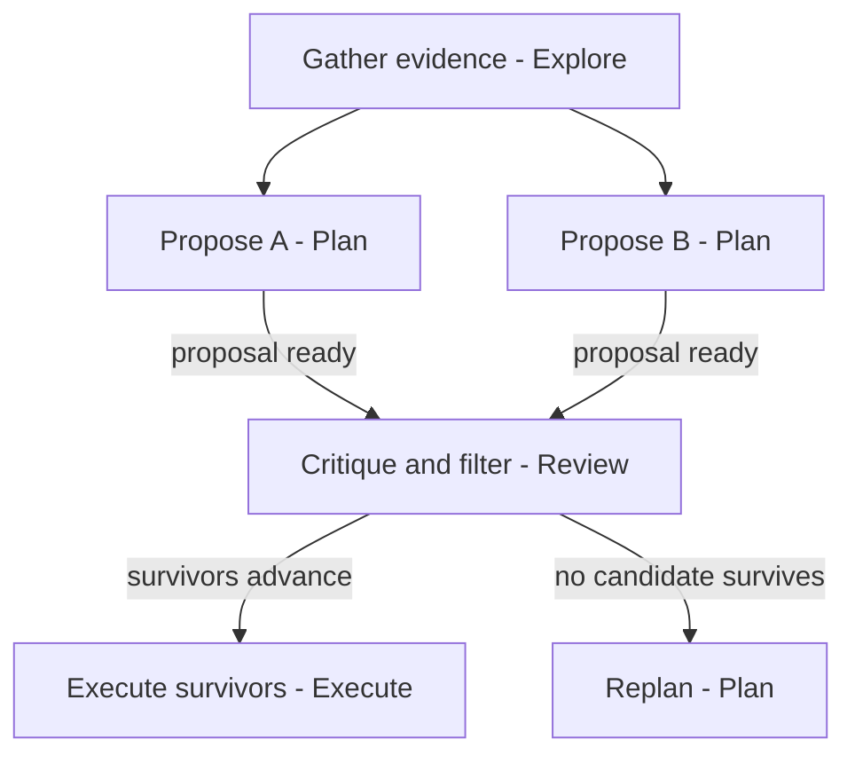
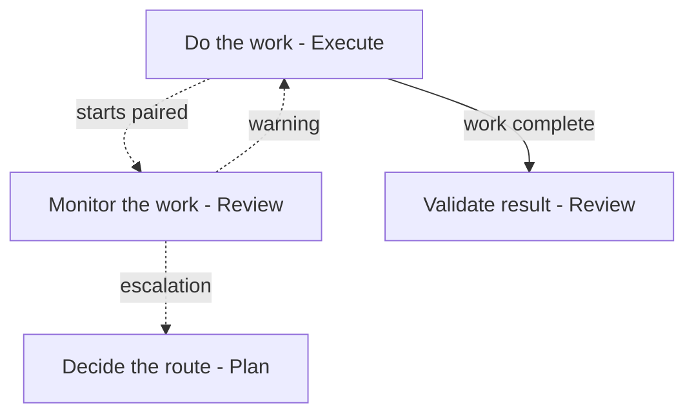
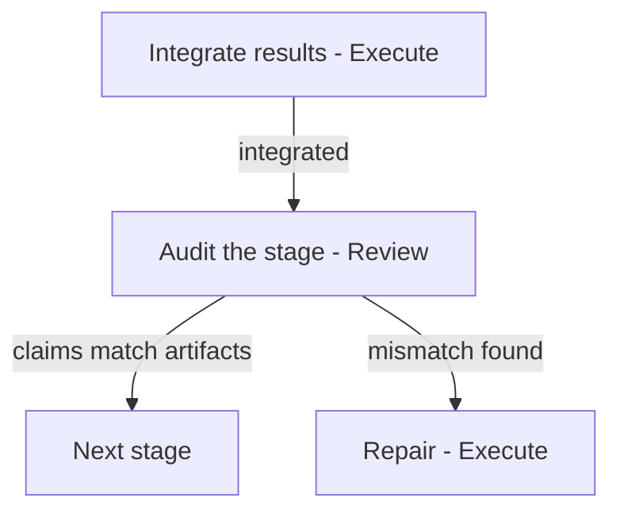

# Technique selection

The spec (`pave-spec.md`) defines what each pattern is. This document says
when a technique earns its cost, when it hurts, and what a minimal setup
looks like. Read it when a plan chooses review structure or enforcement
strength — usually at node-planning time, alongside §9.14.

Each technique here is battle-tested: it held up in production
graph-engineering systems that ran multi-hour autonomous campaigns. Each
also has a price — tokens, wall-clock, and sometimes the size of the wins
the graph will accept. The wrong technique on the wrong work does not just
waste money; it actively makes the outcome worse. So every entry says
**consider**, never **always**: the trigger says when the technique usually
pays, the skip condition says when it usually does not, and the planner's
judgment makes the call. Record the choice and its reason in the
enforcement record (§9.14.1) like any other.

The diagrams are minimal legal shapes. Copy the shape, not the names:
rename every node and outcome for the domain at hand, and drop any part
the consequence level does not justify. A dashed edge shows a relation
the graph maintains — a pairing, an advisory message — not an
outcome-selected transition.

## Adversarial debate

Several actors propose candidates independently, critique each other's
proposals with evidence, and a non-participant keeps what survives.

Debate is a filter, not a vote: its job is to disprove candidates at
arguing cost instead of building cost. Whatever survives — several
candidates, one, or none — advances. A debate that ends with no survivor
is the technique working, not failing.

**Consider when** several options or paths look viable on the surface,
committing to a wrong one is expensive — a long implementation, scarce
hardware, an effect that is hard to undo — and digging deeper can
actually find the caveats before building: evidence to cite, a small
probe to run, a flaw a rival can demonstrate. Proposers battle-test each
other's candidates, and the unviable ones fall out early.

**Skip when** the path is straightforward or the candidates are few and
obvious — there is nothing to filter, and debate is pure token and
wall-clock cost. Skip it too when trying a candidate is cheap: actors
that try, measure, and pivot on their own feedback learn faster than a
panel, and debate converges everyone on the surviving plan — if that
plan is a dead end, every actor is locked onto it. And debate can only
test what evidence reaches before building; when only building a
candidate reveals its caveat, debate is opinion against opinion.

**Cost:** several actors' worth of tokens and wall-clock before any real
work starts. The materiality contract still applies: a critique names a
material defect, never a preference (§9.4).

**Force diverse proposals.** Left alone, proposers drift toward the same
obvious candidate, and the debate compares three copies of one idea. Make
each proposer claim a different target before proposing — for example,
claim components in descending order of measured cost, one per proposer.
Diversity is structural; do not rely on chance.

Spec: §9.2 evidence before commitment; §9.4 independent challenge.

## Advisory monitor

A Review actor watches an Execute actor's work while it happens and
raises concerns early. Advisory: it warns and escalates, never edits or
blocks (§6.4).

**Consider when** the doer could satisfy the check without satisfying the
goal — self-run tests, a wrong environment, a quietly narrowed scope — or
when the work runs long and unattended, so a silent stall or a drifting
method would burn hours before the next gate catches it.

**Skip when** the stage's evidence is already hardened mechanically
(§9.14.1 rungs 1–2 usually catch what a monitor would), and skip it on any
stage that already carries adversarial pressure — a debate needs no
monitor, because the rivals are the monitor.

**Cost:** roughly doubles the stage it watches — a second actor reads and
judges everything the doer does. An over-eager monitor also has a quality
cost: it pushes the doer toward safe choices and shaves off the biggest
wins. Point it at method and liveness, not at taste.

The monitor is entered by pairing: it starts when its Execute node starts
and ends with it (§6.4). Escalations go to whoever owns routing — usually
the lead.

<!-- harness-specific:claude:start -->
**Claude Code binding.** Watching live work means reading the doer's
session transcript, and the transcript format is undocumented — do not
write this from scratch. `scripts/transcript_filter.py` (shipped beside
this doc) is a working reference implementation of the read side: it
filters a `.jsonl` transcript to a readable digest, resumes incrementally
(pass `--start-line` with the previous run's `LAST_LINE_PROCESSED`; the
`--state-file` carries the same offsets for discovered subagents, not for
the main transcript), stops safely at the active write frontier, and can
follow the doer's own subagents (`--include-subagents --projects-dir`). A monitor
loop then is: run the doer in the background, poll the filter on its
transcript at a fixed cadence, judge the new digest, and deliver any
concern by message to the doer or the lead. The loop design — cadence,
what counts as a concern, who receives it — is still yours. The script is
pinned to current harness internals: verify it once on a live transcript
before shipping it in a generated workflow (its header says how).

This transcript binding is harness-specific. A Codex workflow can select an
advisory monitor only when it has a verified live-work evidence source with
equivalent timing and coverage. Do not claim parity from a different artifact
or from post-run output alone.
<!-- harness-specific:claude:end -->

Spec: §6.4 pairing an advisory monitor with execution; §7 roles.

## Stage audit by reconstruction

After a stage completes, an independent reviewer rebuilds what should
have happened — from the artifacts alone, never from the doer's account —
and compares that reconstruction against what the state claims.

**Consider when** claims accumulate across stages or rounds and a wrong
one compounds: a baseline that drifted, evidence that went stale, a state
field that contradicts the artifact behind it. No single node sees these;
the audit reads across them.

**Skip when** the run is short and the next node consumes the evidence
directly — reading the artifact is then already the audit.

The recipe, in order:

1. Reconstruct: from state and artifacts alone, derive what should exist.
   Do this before reading any checklist — a checklist read first anchors
   the auditor to the expected items instead of to the artifacts.
2. Check the invariants a schema cannot express (cross-field, cross-round).
3. Reconcile the reconstruction against the claimed state.
4. Verdict: accept, or findings ranked by severity. The auditor holds no
   write authority over the work it checks — the judge is never the doer
   (§5.3.1).

**Cost:** one reviewer dispatch per audited boundary. Audit the expensive
boundaries — acceptance, integration, round close — not every edge.

Spec: §7 auditor role; §8.3 existence is not approval.

## Four smaller techniques

**The doer never writes its own acceptance check.** A doer that writes
both the work and the check that accepts it will drift the check toward
what was built. Have another actor produce the check, blind to the doer's
own tests. This is rung 2 of the harden-first ladder (§9.14.1). Freeze
what the check applies — thresholds, rubrics, references — before the
attempt starts: a doer who can retune the standard after a failing check
has written its own acceptance after all.

**One terminal metric.** Judge progress against one system-level
measurement, produced by an instrument the doer did not author and cannot
tamper with — the doer may run it, because the value comes from the
instrument, not the doer's judgment. Local numbers feed decisions; they
never count as progress. When many proxy numbers are available, the doer
will eventually improve one that does not matter (§9.1, §5.3.1).

**Rejection ledger.** When a candidate dies, record why, with the
measurement that killed it. Long runs rediscover dead ends silently
without one, and a recorded negative result honestly supports an
`exhausted` outcome later (§4.7, §9.11).

**Edge-triggered reminders.** Prefer injecting guidance on entry to a new
state over repeating it on every event. A reminder repeated on every
action becomes wallpaper the actor learns to ignore; one that fires when
state changes lands while it is news. The exception is the one §9.14.2
names: a rule that must hold on every action of the run needs a mechanism
that fires on every action (§4.7, §9.14.2).

## Retire what does not pay

Every guardrail is a hypothesis about a failure. Measure what it catches.
One that changed no decision over a fair sample of runs is pure friction:
remove it, and fold any real check it performed into an existing gate.
The burden of proof stays on adding structure, never on staying simple
(§4.11).
